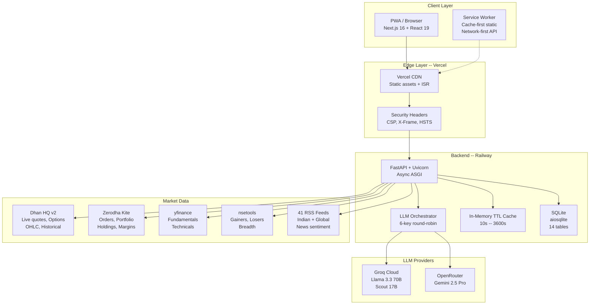

---
tags:
  - stocky-ai
  - engineering
  - architecture
created: 2026-04-07
status: complete
---

# Architecture

> [!info] High-Level Design
> Client (PWA) -> Vercel Edge (CDN + CSP) -> FastAPI (Railway) -> LLM Providers (Groq/OpenRouter) + Market Data (Dhan/Kite/yfinance/RSS)

## System Architecture Diagram

## Request Flow

1. User sends message via chat input
2. Frontend POST to `/api/chat` with `{message, conversation_id, deep}`
3. **Intent Parsing** (2-layer):
   - Layer 1: Regex NLP (`_parse_natural()`) -- 30+ regex patterns, zero API cost
   - Layer 2: AI Fallback (`interpret_intent()`) -- Groq Llama 3.3 70B, temp 0.1, JSON mode
4. Intent routes to one of **31 handlers** (analyse, scan, options, news, etc.)
5. Handler fetches market data (Dhan, yfinance, nsetools, RSS)
6. **LLM Orchestrator** enhances with AI analysis:
   - Quick mode: single Groq call (512-1024 tokens)
   - Deep mode: 3-stage pipeline (primary -> critique -> synthesis)
7. Response returns structured JSON + `ai_analysis` + `ai_metadata`
8. Frontend renders the appropriate **card component** via dynamic import

## Component Counts

| Layer | Count | Details |
|-------|-------|---------|
| Card components | 27 | Dynamic imports in MessageBubble.tsx |
| Backend handlers | 31 | analyse, scan, options, news, overview, etc. |
| API endpoints | 40+ | Chat, research, market data, trading, portfolio, export, analytics |
| Database tables | 14 | conversations, trades, watchlist, alerts, analytics, etc. |
| LLM models | 4 | Llama 3.3 70B, Scout 17B, GPT-OSS 120B, Gemini 2.5 Pro |
| RSS sources | 41 | 8 categories: Indian, Global, Commodities, Energy, Asia-Pacific, Geopolitical |

## Latency Profile

| Operation | Typical Latency |
|-----------|----------------|
| Regex intent parse | <1ms |
| AI intent parse (Groq) | 200-500ms |
| Quick analysis | 1-3s |
| Deep 3-stage pipeline | 5-12s |
| Triad research (3 agents) | 8-15s |
| Council research (6 agents) | 15-30s |
| Market data fetch (Dhan) | 100-300ms |
| yfinance fundamentals | 1-3s |
| RSS news aggregation | 2-5s |

## Related Notes
- [[Frontend Stack]]
- [[Backend Stack]]
- [[LLM Orchestration]]
- [[Current Architecture]]
