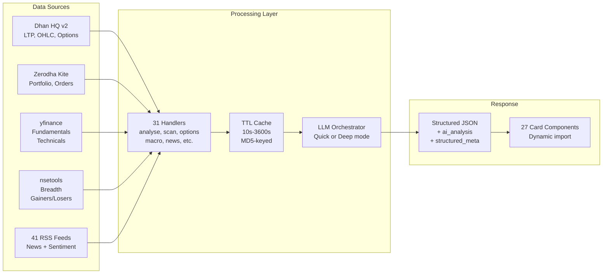

---
tags:
  - stocky-ai
  - engineering
  - data
created: 2026-04-07
status: complete
---

# Data Pipeline



## Market Data Sources

| Source | Data | Refresh | Method |
|--------|------|---------|--------|
| **Dhan HQ v2** | Live LTP, OHLC, option chains, historical candles | Real-time | Async HTTP (`httpx`) |
| **Zerodha Kite** | Portfolio, holdings, positions, margins, order placement | Real-time | SDK (`kiteconnect`) |
| **yfinance** | Fundamentals (PE, ROE, D/E), technicals (RSI, MACD, SMA), quarterly results | 15-min delay | ThreadPoolExecutor |
| **nsetools** | Top gainers/losers, advances/declines breadth | 8s timeout | Sync HTTP |
| **41 RSS feeds** | Market news with keyword-based sentiment scoring | On-demand | feedparser |

## Dhan HQ Integration

- **73 securities mapped** (Nifty 50 + major indices -> Dhan security IDs)
- **Token auto-renewal**: Every 20 hours via background task, stored in SQLite + memory
- **Fallback chain**: Memory token -> DB token -> API renewal -> env var fallback
- **Endpoints used**: `/marketfeed/ltp`, `/marketfeed/ohlc`, `/optionchain`, `/optionchain/expirylist`, `/charts/historical`

## Options Analytics Pipeline

```
get_expiry_list() -> classify weekly/monthly
    -> get_option_chain(weekly) + get_option_chain(monthly)
    -> compute_chain_summary() -- PCR, Max Pain, top OI strikes
    -> compute_iv_skew() -- ATM vs OTM +/-5%
    -> compute_volume_hotspots() -- top 5 by volume
    -> compute_expected_move() -- ATM straddle premium
    -> enrich_oi_interpretation() -- Long Buildup / Short Covering
    -> derive_signals() -- rules-based (PCR thresholds, max pain distance)
    -> compute_verdict() -- BULLISH/BEARISH/NEUTRAL + confidence
    -> LLM orchestrator -> ai_analysis
```

## 41 RSS News Sources (8 Categories)

| Category | Count | Sources |
|----------|-------|---------|
| **Indian Markets** | 16 | LiveMint (Markets, Companies, Economy, Money), ET (Markets, Stocks, Industry), Moneycontrol, CNBC-TV18 (2), Business Standard, NDTV Profit, Hindu BusinessLine (2), Indian Express Biz, Business Today |
| **Global/US** | 5 | Reuters, CNBC US, MarketWatch, Yahoo Finance US, BBC World |
| **Premium Global** | 3 | Bloomberg, AP Business, Al Jazeera |
| **CNBC** | 1 | CNBC Top News |
| **Commodities** | 3 | ET Commodities, MC Commodities, FT Commodities |
| **Energy/Metals** | 4 | OilPrice, Kitco Gold, Rigzone, Mining.com |
| **Asia-Pacific** | 3 | Nikkei Asia, SCMP, Straits Times |
| **Geopolitical** | 4 | TASS, DefenseOne, War on the Rocks, The Diplomat |
| **Central Banks** | 1 | Fed Press Releases |

## Sentiment Scoring

Weighted keyword matching:
- Title keywords = **3x weight** (catches broker calls like "Reduce Wipro")
- 25 positive keywords: growth, beat, surge, rally, upgrade, bullish...
- 25 negative keywords: decline, miss, crash, warning, downgrade, bearish...
- Score normalized to sentiment range using: `(pos - neg) / (pos + neg + 1)`

## Caching Strategy

| Data Type | TTL | Rationale |
|-----------|-----|-----------|
| Live quotes (Dhan) | 10-30s | Near real-time requirement |
| Scan results | 120s | Expensive batch download (yfinance 100 stocks) |
| Technical indicators | 300s | Computed from daily data, stable intraday |
| Options analytics | 300s | Chain data changes moderately |
| Fundamentals | 3600s | Quarterly data, rarely changes |
| News feeds | 1800s | RSS feeds update every 15-30 min |

Implementation: `@cached(ttl=N)` decorator in `cache.py`, MD5-hashed args for cache key, `clear_all_caches()` on Dhan token renewal.

## Related Notes
- [[Backend Stack]]
- [[Trading Integration]]
- [[Architecture]]
