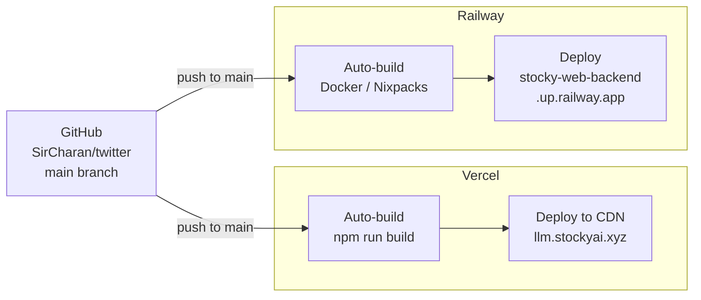

---
tags:
  - stocky-ai
  - engineering
  - deployment
created: 2026-04-07
status: complete
---

# Deployment

## Infrastructure

| Layer | Service | Config |
|-------|---------|--------|
| **Frontend** | Vercel | Auto-deploy on push to `main`, edge CDN, ISR |
| **Backend** | Railway | Auto-deploy on push, `uvicorn app.main:app --host 0.0.0.0` |
| **Database** | Railway volume | SQLite file persisted across deploys |
| **DNS** | Vercel | `llm.stockyai.xyz` -> Vercel, custom domain |

## Build Pipeline

**Frontend** (`npm run build`):
1. `stamp-sw` -- Node.js script replaces SW cache name with build timestamp
2. `next build` -- Compiles TypeScript, tree-shakes, code-splits, generates static pages

**Backend**: Railway auto-detects Python, installs from `requirements.txt`, runs uvicorn.

## Deployment Frequency

- 79 commits in 60 days = **1.3 deploys/day average**
- Both Vercel and Railway auto-deploy on every push to `main`
- Zero-downtime deploys (Vercel: atomic swap, Railway: rolling restart)

## Service Worker Versioning

Each build stamps the SW cache name with a build timestamp (`stocky-{timestamp}`). On deploy:
1. New SW is installed alongside old one
2. `activate` event clears old caches (any cache not matching new name)
3. Users get new assets on next page load

## Related Notes
- [[Architecture]]
- [[Frontend Stack]]
- [[Backend Stack]]
