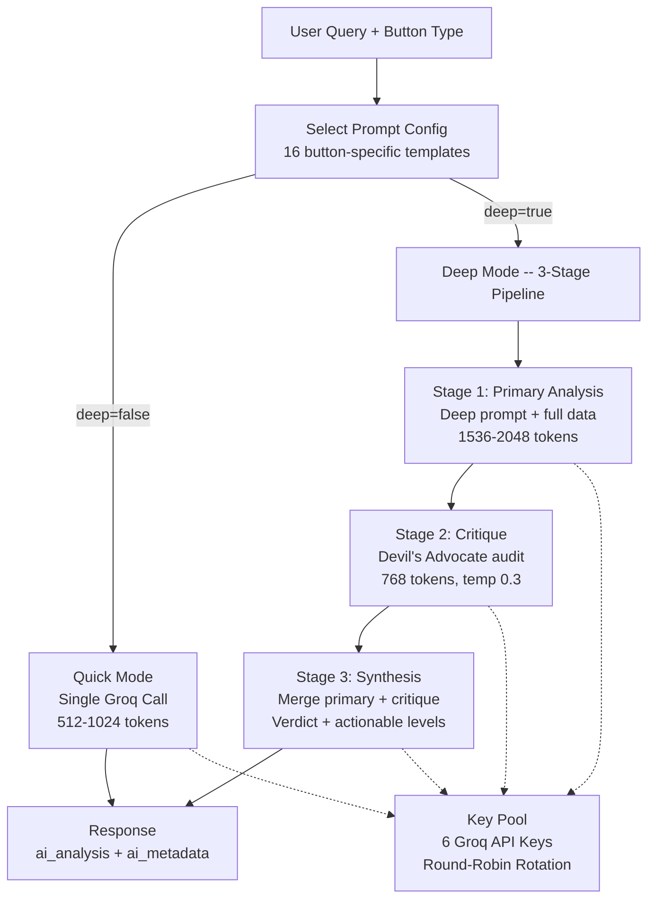

---
tags:
  - stocky-ai
  - engineering
  - llm
created: 2026-04-07
status: complete
---

# LLM Orchestration

> [!info] Central AI Layer
> Every handler calls `orchestrator.enhance(button_type, raw_data, deep=False)` instead of calling LLM clients directly. The orchestrator selects the right prompt, model, token budget, and pipeline.

## Model Selection

| Model | Provider | Use Case | Tokens/Call |
|-------|----------|----------|-------------|
| **Llama 3.3 70B** | Groq | General chat, quick analysis, verdicts, intent parsing | 512-2048 |
| **Llama 4 Scout 17B** | Groq | Triad/Crew debate agents (lighter, faster) | 512-1024 |
| **GPT-OSS 120B** | Groq | High-level conversation synthesis | 1024 |
| **Gemini 2.5 Pro** | OpenRouter | Deep research (largest context, best reasoning) | 4096 |

## Key Pool Architecture

6 Groq API keys rotate round-robin via an async-safe `KeyPool` class:

```
Request 1 -> Key 1
Request 2 -> Key 2
...
Request 6 -> Key 6
Request 7 -> Key 1 (wraps around)
```

> [!tip] Why Round-Robin?
> Groq's free tier has per-key rate limits (~30 RPM). Round-robin across 6 keys gives effective **180 RPM**. Each key gets its own `AsyncGroq` client instance (connection pooling).

**Implementation**: `KeyPool` class in `llm_orchestrator.py` with `asyncio.Lock()` for thread safety. On failure, the next key is tried automatically (1 retry per call).

## Quick vs Deep Mode



## 16 Button-Specific Prompt Configs

All in `prompts/orchestrator.py`, each with `quick_prompt`, `deep_primary`, token budgets, and temperature:

| Button | Score System | Key Output Sections | Temp |
|--------|-------------|---------------------|------|
| **Analyse** | Stocky Score 0-20 (F/T/S/M) | Scenario table, trade setup, catalyst watch | 0.5 |
| **Overview** | Breadth Score 0-20 | Regime, VIX, FII/DII, risk-reward of the day | 0.5 |
| **News** | Sentiment Score 0-20 | Impact matrix, contrarian thesis, FII reaction | 0.5 |
| **Scan** | Scan Score 0-20 | Scoring matrix, pattern cluster, sector breakdown | 0.4 |
| **Chart** | Confidence HIGH/MED/LOW | Pattern ID, indicator dashboard, trade setup | 0.4 |
| **Compare** | Clear Winner pick | Head-to-head 8+ rows, investor frames | 0.5 |
| **IPO** | HOT/WARM/COLD/SELECTIVE | Subscribe/Avoid verdicts, listing day playbook | 0.5 |
| **Macro** | RISK-ON/OFF/MIXED | Cross-asset dashboard, RBI path, sector implications | 0.5 |
| **RRG** | Leaders/Laggards | Rotation narrative, trade idea, macro overlay | 0.5 |
| **Earnings** | Earnings Score 0-20 | Most market-moving, options play, sector trend | 0.5 |
| **Dividends** | STRONG/ADEQUATE/AT RISK | Yield vs alternatives, covered call overlay | 0.5 |
| **Sectors** | Sector Score 0-20 | Cyclical vs defensive, FII preference, ETF idea | 0.5 |
| **Valuation** | CHEAP/FAIR/EXPENSIVE/BUBBLE | Equity risk premium, most mispriced, contrarian | 0.5 |
| **FII/DII** | Flow Score 0-20 | Flow regime, F&O positioning, market impact | 0.4 |
| **Options** | Signal Score 0-20 | PCR analysis, max pain, IV skew, strategy table | 0.4 |
| **Top Stocks** | Pulse Score 0-20 | Cross-scan conviction, sector signal, risk flag | 0.4 |

## Deep Pipeline Details

### Stage 1: Primary Analysis
- Uses button-specific `deep_primary` prompt
- 1536-2048 tokens
- Full data context injected

### Stage 2: Critique (Universal)
- **"Devil's Advocate"** auditor prompt (`DEEP_CRITIQUE_UNIVERSAL`)
- Rates each claim: Verified / Plausible / Unverified / Refuted
- Checks for hallucinations against provided data
- 768 tokens, temperature 0.3 (more precise)

### Stage 3: Synthesis (Universal)
- Merges primary + critique into final report (`DEEP_SYNTHESIS_UNIVERSAL`)
- Outputs: Verdict, Stocky Score X/20, Key Evidence, Risks, Payoff Asymmetry, Actionable trades
- IST timestamp injected

> [!warning] All prompts enforce
> "If you lack data for a section, SKIP IT ENTIRELY. Never output empty tables or placeholders."

## Related Notes
- [[Architecture]]
- [[Multi-Agent Debate]]
- [[AI Agents]]
- [[Backend Stack]]
