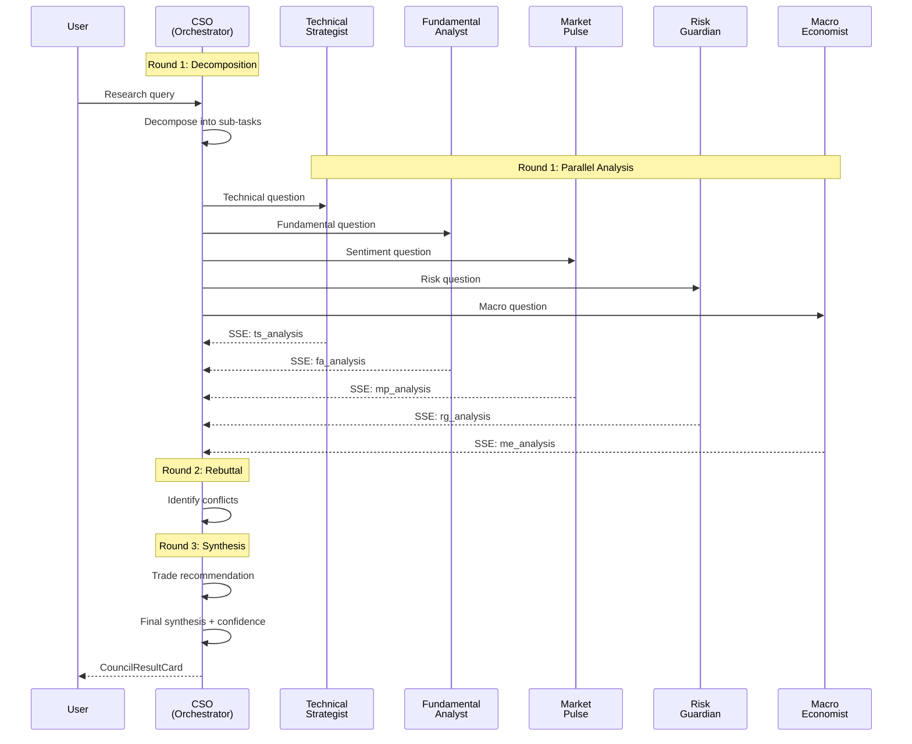

---
tags:
  - stocky-ai
  - engineering
  - agents
created: 2026-04-07
status: complete
---

# Multi-Agent Debate

> [!info] Three architectures with increasing depth and agent count
> Triad (3 agents) -> Crew (7 agents) -> Council (6 agents, 3 rounds)

## Triad Research (3 Agents)

| Agent | Role | Model | Key | Personality |
|-------|------|-------|-----|-------------|
| **Dr. Aris Thorne** | Lead Researcher | Llama 4 Scout 17B | Key 1 | Data-hungry, methodical, structured |
| **Silas Vance** | Skeptic & Verifier | Llama 4 Scout 17B | Key 2 | Cynical, forensic, contrarian |
| **Nexus** | Moderator & Synthesizer | Llama 4 Scout 17B | Key 3 | Balanced, decisive, confidence-scored |

**Pipeline**: Nexus briefing -> Aris researches (thesis, moat, financials, valuation, risks) -> Silas critiques (claim audit: Verified/Plausible/Unverified/Refuted) -> Nexus synthesizes with Confidence Score 0-100.

**SSE Events**: `briefing` -> `aris_analysis` -> `silas_critique` -> `synthesis`

## Crew Research (7 Agents)

Sequential pipeline, each agent builds on previous output:

```
Planner -> Fundamental Analyst -> Sector/Macro -> News/Sentiment -> Technical -> Critic -> Synthesizer
```

**Key cycling**: Agents cycle through 3 API keys:
- `planner`, `fundamental`, `critic` -> Key 1 (aris)
- `sector_macro`, `synthesizer` -> Key 2 (silas)
- `news_sentiment` -> Key 3 (nexus)

All use Llama 4 Scout 17B model.

## Council Debate (6 Agents, 3 Rounds)



### Council Agent Details

| Agent | Short | Model Tier | Model | Skills |
|-------|-------|-----------|-------|--------|
| **Technical Strategist** | TS | Heavy | Llama 3.3 70B | Chart patterns, RSI/MACD/Bollinger, S/R, Entry/Exit |
| **Fundamental Analyst** | FA | Heavy | Llama 3.3 70B | Financial ratios, Earnings quality, Moat, Valuation |
| **Market Pulse** | MP | Light | Scout 17B | News sentiment, FII/DII flows, Options chain, Event risk |
| **Risk Guardian** | RG | Light | Scout 17B | Position sizing, Stop-loss, VaR, Portfolio impact |
| **Macro Economist** | ME | Light | Scout 17B | RBI policy, Global cues, Sector rotation, Inflation/FX |
| **Chief Synthesis Officer** | CSO | Heavy | Llama 3.3 70B | Conflict resolution, Confidence scoring, Final recommendation |

> [!tip] Model Routing Strategy
> Heavy agents (TS, FA, CSO) use 70B for analytical depth. Light agents (MP, RG, ME) use 17B for speed. This cuts total latency by ~40% while maintaining quality where it matters.

### Key-to-Agent Mapping (6 keys, 6 agents)

| Agent | API Key | Model |
|-------|---------|-------|
| TS | Key 1 | 70B heavy |
| FA | Key 2 | 70B heavy |
| MP | Key 3 | 17B light |
| RG | Key 4 | 17B light |
| ME | Key 5 | 17B light |
| CSO | Key 6 | 70B heavy |

### Council 9-Step Pipeline

| Step | Label | Agent | Round |
|------|-------|-------|-------|
| 1 | Query Decomposition | CSO | 1 |
| 2 | Market Data Fetch | (system) | 1 |
| 3 | Technical Analysis | TS | 1 |
| 4 | Fundamental Deep Dive | FA | 1 |
| 5 | Sentiment & News Flow | MP | 1 |
| 6 | Risk & Scenario Modeling | RG | 1 |
| 7 | Macro Context | ME | 1 |
| 8 | Trade Idea Generation | CSO | 3 |
| 9 | Final Synthesis | CSO | 3 |

## SSE Streaming

All deep research endpoints use **Server-Sent Events** (`text/event-stream`):

```
data: {"phase": "bull_analysis", "agent": "Bull", "content": "...", "thinking": "..."}
data: {"phase": "bear_analysis", "agent": "Bear", "content": "..."}
data: {"phase": "synthesis", "confidence": 72, "verdict": "HOLD"}
```

Frontend renders each phase in real-time via `DebateProgressCard` / `CouncilProgressCard`.

## Related Notes
- [[AI Agents]]
- [[LLM Orchestration]]
- [[Architecture]]
