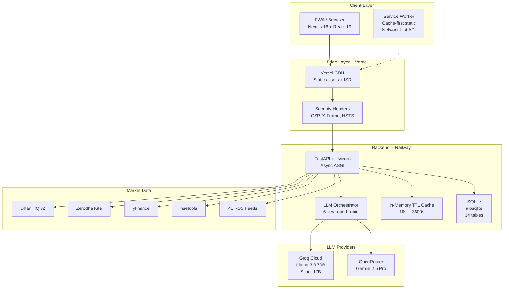

---
tags:
  - stocky-ai
  - system-design
  - architecture
created: 2026-04-07
status: complete
---

# Current Architecture

> [!info] As-is system design -- single-user, personal tool

## System Context

## Current Scale

| Metric | Current Value |
|--------|--------------|
| Requests per second | ~10 (single user) |
| Concurrent users | 1 |
| Data volume | ~50 MB (SQLite) |
| Database QPS | ~100 |
| Message rate | ~1 msg/s |
| Frontend components | 50+ |
| API endpoints | 40+ |
| Deploy frequency | 1.3/day |

## Key Design Choices

1. **Monolith backend**: Single FastAPI process handles everything -- chat, trading, market data, AI
2. **SQLite**: Zero-ops database, single-file backup, sufficient for single-user
3. **In-memory cache**: No Redis needed for single process
4. **Free-tier LLMs**: 6 Groq API keys in round-robin = 180 RPM for $0
5. **SSE for streaming**: Server-Sent Events for real-time agent debate updates

## Strengths of Current Design

- **Zero infrastructure cost** (Vercel free + Railway free + Groq free)
- **Sub-second intent parsing** via regex (no API call for common queries)
- **10x faster inference** than OpenAI via Groq LPU
- **Full PWA** with offline support, installable on mobile
- **1.3 deploys/day** velocity with auto-deploy on push

## Weaknesses

- Single-writer SQLite = cannot handle concurrent writes
- In-memory cache = lost on restart
- No test suite = regression risk
- localStorage JWT = not secure for multi-user
- yfinance 15-min delay = not real-time

## Related Notes
- [[Architecture]]
- [[Scaling Plan]]
- [[Tradeoffs]]
