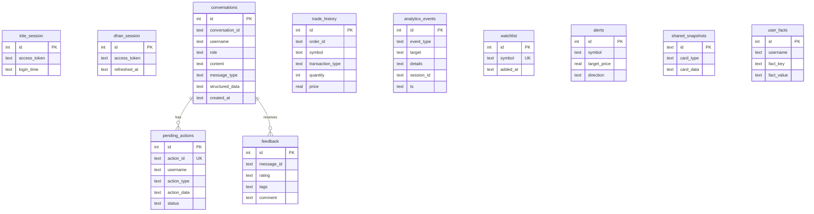

---
tags:
  - stocky-ai
  - system-design
  - database
created: 2026-04-07
status: complete
---

# Database Schema

> [!info] 14 SQLite tables managed via aiosqlite (async, non-blocking)

## Entity Relationship Diagram

## Table Details

| Table | Purpose | Key Columns |
|-------|---------|------------|
| `kite_session` | Zerodha auth token (singleton) | access_token, login_time |
| `dhan_session` | Dhan auth token (singleton) | access_token, refreshed_at |
| `conversations` | Chat history | conversation_id, role, content, structured_data |
| `pending_actions` | 2-phase trade confirmation | action_id (unique), action_type, status |
| `trade_history` | Executed orders | symbol, qty, price, status |
| `analytics_events` | User behavior tracking | event_type, target, session_id |
| `watchlist` | Saved stock symbols | symbol (unique) |
| `feedback` | Thumbs up/down + tags | rating, tags (JSON), comment |
| `alerts` | Price alerts | symbol, target_price, direction (above/below) |
| `shared_snapshots` | Shareable card screenshots | card_type, card_data (JSON) |
| `user_facts` | User memory/preferences | fact_key, fact_value |
| `web_users` | Auth (legacy, hardcoded "CK") | username, password_hash |
| `command_log` | Command audit trail | command, args, source |
| `api_call_log` | API usage tracking | service, endpoint, tokens |

## Indexes

- `analytics_events(ts)` -- time-range queries
- `analytics_events(event_type)` -- event filtering
- `watchlist(symbol)` -- unique constraint + lookup

## Design Notes

> [!tip] Why SQLite?
> Zero ops, instant setup, single-file backup. Sufficient for single-user personal tool. Limitation: single-writer, no replication, no concurrent writes.

- All tables auto-created on startup via `CREATE TABLE IF NOT EXISTS`
- `aiosqlite` for non-blocking async access
- No ORM -- raw SQL with parameterized queries
- `structured_data` column stores JSON blobs for card data

## Related Notes
- [[Backend Stack]]
- [[Current Architecture]]
- [[Scaling Plan]]
