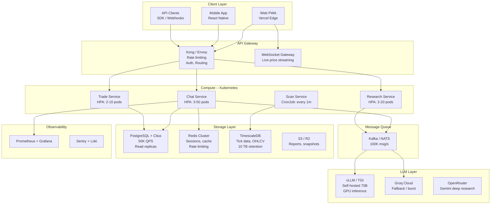

---
tags:
  - stocky-ai
  - system-design
  - scaling
created: 2026-04-07
status: complete
---

# Scaling Plan

> [!info] Migration path from single-user personal tool to 50K concurrent users

## Target Load Metrics

| Metric | Current | Target |
|--------|---------|--------|
| Requests per second (RPS) | ~10 | 10,000 |
| Concurrent users | 1 | 50,000 |
| Data volume | ~50 MB | 10 TB |
| Throughput | ~1 MB/s | 1 GB/s |
| Database QPS | ~100 | 50,000 |
| Message rate | ~1 msg/s | 100,000 msg/s |

## Scaled Architecture

## Phase 1: Multi-User Foundation (10-100 users)

| Change | From | To |
|--------|------|-----|
| Auth | Hardcoded "CK" | Clerk / Auth0 (JWT + refresh tokens) |
| Database | SQLite | PostgreSQL (Supabase or managed RDS) |
| Cache | In-memory dict | Redis (Upstash or managed ElastiCache) |
| Sessions | localStorage | HttpOnly cookies + Redis sessions |

## Phase 2: Horizontal Scale (100-10K users)

| Change | From | To |
|--------|------|-----|
| Backend | Single Railway instance | Kubernetes (EKS/GKE) with HPA |
| API Gateway | Direct CORS | Kong/Envoy with rate limiting + auth |
| LLM | 6 Groq keys | Enterprise Groq + self-hosted vLLM (70B on A100) |
| Market Data | yfinance polling | WebSocket feed (Dhan WS / vendor) |
| Queue | None | Kafka/NATS for async LLM calls |
| CDN | Vercel default | Cloudflare R2 + CDN for static |

## Phase 3: Production Scale (10K-50K concurrent)

| Change | From | To |
|--------|------|-----|
| Database | Single PostgreSQL | Citus (distributed) + read replicas |
| Time-series | None | TimescaleDB for tick data (10 TB) |
| Streaming | SSE polling | WebSocket gateway + Redis pub/sub |
| Storage | Local files | S3/R2 for reports, screenshots |
| Observability | Console logs | Prometheus + Grafana + Sentry + Loki |
| Search | Regex intent | Vector DB (Qdrant) + semantic search |

## LLM Cost Optimization at Scale

- Self-host Llama 70B on 2x A100 GPUs (~$3/hr) for 80% of calls
- Groq as burst overflow (free tier for <180 RPM)
- Gemini/Claude only for deep research (pay-per-call)
- Estimated: **$0.001/query at 10K RPM** vs $0.03/query on GPT-4

## Database Sharding Strategy

- Shard by `user_id` (conversations, trades, watchlist)
- Global tables (market data, news) on separate read-replica cluster
- TimescaleDB for OHLCV data with automatic 90-day compression

## Related Notes
- [[Current Architecture]]
- [[Tradeoffs]]
- [[Interview Prep]]
