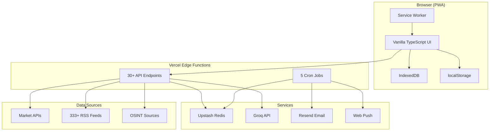

# Project Overview

**Stocky Terminal** is an open-source Bloomberg alternative purpose-built for the Indian market. It combines live market data, geopolitical OSINT, AI-driven trade signals, and automated daily briefs into a single browser-based Progressive Web App.

> [!info] Quick Facts
> - **Live URL:** [terminal.stockyai.xyz](https://terminal.stockyai.xyz)
> - **GitHub:** [github.com/SirCharan/stocky-terminal](https://github.com/SirCharan/stocky-terminal)
> - **Version:** v2.1.0
> - **License:** AGPL-3.0

## Key Statistics

| Metric | Value |
|---|---|
| API Endpoints | 30+ |
| Map Layers | 27+ |
| UI Panels | 12+ |
| Email Subscribers | 70+ |
| Cron Jobs | 5 |
| News Feeds | 333+ |
| Candlestick Patterns | 13 |
| OSINT Data Sources | 8+ |
| Countries Profiled | 30 |
| Crypto Tracked | 25 |

## What Makes It Different

Stocky Terminal occupies a unique niche: it is the **only** terminal that combines India-specific market data, geopolitical OSINT intelligence, AI-generated trade signals, and automated daily briefs — all running in a zero-framework browser PWA with no backend database beyond Redis caching.

> [!tip] No Frameworks
> The entire frontend is vanilla TypeScript compiled with Vite. No React, no Vue, no Angular. Direct DOM manipulation with targeted patching yields sub-50ms interaction latency.

## Core Capabilities

1. **Live Market Data** — Real-time quotes from Zerodha Kite Connect, Dhan API, Yahoo Finance with race-pattern fallback
2. **TradingView Charts** — Lightweight Charts v5 with candlestick pattern detection (13 patterns, zero API cost)
3. **Options Chain** — Full Greeks, OI, IV, PCR, max pain for Nifty, BankNifty, Sensex, FINNifty, MIDCPNifty
4. **AI Trade Signals** — Groq-powered (Llama 3.3 70B) signal generation with time-weighted aggregation and live validation
5. **OSINT Map** — 27+ deck.gl layers covering armed conflicts, earthquakes, fires, flight tracking, vessel tracking, internet outages
6. **Daily Briefs** — Automated 8AM/8PM IST briefs covering indices, sectors, commodities, forex, crypto with AI outlook
7. **FII/DII Dashboard** — Live institutional flow data from NSE India
8. **Country Dossiers** — Click any country on the map for GDP, trade data, political stability analysis
9. **News Sentiment** — 333+ RSS feeds with keyword-based sentiment classification and asset detection
10. **Push Notifications** — Web Push API with VAPID keys for high-impact signals and daily briefs

## Architecture Overview

## Project Timeline

| Phase | Focus | Status |
|---|---|---|
| Phase 1 | Core terminal, charts, market data | Completed |
| Phase 2 | Screener, watchlist, options tools | Planned |
| Phase 3 | AI Copilot, WebSocket, desktop app | Planned |
| Phase 4 | OSINT map, daily briefs, push | Completed |
| Phase 5 | Promoter pledging, MF tracker | Planned |

> [!warning] Active Development
> Stocky Terminal is under active development. Features ship weekly. The roadmap is ambitious but grounded in working code — every Phase 1 and Phase 4 item listed above is live in production.

## Related Notes

- [[Tech Stack]]
- [[Competitive Landscape]]
- [[System Architecture]]
- [[Daily Market Brief]]
- [[Map System]]
- [[AI Pipeline]]
- [[Future Roadmap]]
- [[Completed Features]]
