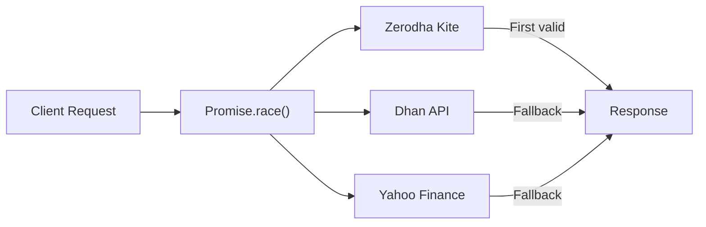

# API Layer Design

Stocky Terminal's backend consists of 30+ Vercel Edge Functions that handle data aggregation, caching, and AI processing. Every endpoint runs at the edge for minimal latency.

> [!info] Edge Functions vs Serverless
> Edge Functions run in V8 isolates (not Node.js containers), giving ~0ms cold start. They have access to Web APIs but not Node.js built-ins. This forces lean, efficient code.

## Race Pattern for Multi-Source Quotes

The quote endpoint uses a race pattern to maximize reliability:



**Priority order:**
1. **Zerodha Kite Connect** — Most accurate for NSE/BSE, requires daily token refresh
2. **Dhan API** — Good alternative, no token refresh needed
3. **Yahoo Finance** — Universal fallback, covers global symbols too

If Zerodha responds first with valid data, the other promises are abandoned. If Zerodha fails (token expired, rate limit), Dhan or Yahoo picks up seamlessly.

## Batch Fetching with Stagger

For watchlist/overview screens that need 30+ symbols:

```typescript
async function batchFetchQuotes(symbols: string[]): Promise<Quote[]> {
    const BATCH_SIZE = 10;
    const STAGGER_MS = 100;
    const results: Quote[] = [];

    for (let i = 0; i < symbols.length; i += BATCH_SIZE) {
        const batch = symbols.slice(i, i + BATCH_SIZE);
        const batchResults = await Promise.allSettled(
            batch.map(s => fetchQuote(s))
        );
        results.push(...batchResults.filter(r => r.status === 'fulfilled').map(r => r.value));

        if (i + BATCH_SIZE < symbols.length) {
            await new Promise(r => setTimeout(r, STAGGER_MS));
        }
    }
    return results;
}
```

> [!tip] Why Stagger?
> Upstream APIs (especially Yahoo Finance) rate-limit aggressively. A 100ms delay between batches of 10 keeps us well under limits while still completing 50 symbols in under 1 second.

## Circuit Breaker Pattern

Each upstream data source has a circuit breaker:

| State | Behavior | Transition |
|---|---|---|
| **Closed** | Requests pass through normally | 3 consecutive failures → Open |
| **Open** | All requests short-circuit to fallback | 30s timeout → Half-Open |
| **Half-Open** | Single probe request allowed | Success → Closed, Failure → Open |

```typescript
class CircuitBreaker {
    private failures: number = 0;
    private state: 'closed' | 'open' | 'half-open' = 'closed';
    private lastFailure: number = 0;
    private readonly THRESHOLD = 3;
    private readonly TIMEOUT = 30_000;

    async execute<T>(fn: () => Promise<T>, fallback: () => Promise<T>): Promise<T> {
        if (this.state === 'open') {
            if (Date.now() - this.lastFailure > this.TIMEOUT) {
                this.state = 'half-open';
            } else {
                return fallback();
            }
        }
        try {
            const result = await fn();
            this.reset();
            return result;
        } catch (e) {
            this.recordFailure();
            return fallback();
        }
    }
}
```

## Cache Strategy

Every endpoint sets appropriate cache headers:

```typescript
// Typical cache header pattern
return new Response(JSON.stringify(data), {
    headers: {
        'Content-Type': 'application/json',
        'Cache-Control': 's-maxage=15, stale-while-revalidate=30',
        'Access-Control-Allow-Origin': '*',
    }
});
```

| Endpoint Type | s-maxage | stale-while-revalidate | Redis TTL |
|---|---|---|---|
| Live quotes | 10s | 20s | 15s |
| Market overview | 15s | 30s | 30s |
| Options chain | 10s | 20s | 30s |
| News/RSS | 900s (15min) | 1800s | 15min |
| AI insights | 300s (5min) | 600s | 5min |
| Country profile | 3600s (1h) | 7200s | 24h |
| Static data | 86400s (1d) | 172800s | 7d |

> [!warning] CORS
> All endpoints include `Access-Control-Allow-Origin: *` since the terminal is a public tool. For future authenticated features, this will need to be tightened to `terminal.stockyai.xyz`.

## Error Handling

Every endpoint follows a standard error response pattern:

```typescript
try {
    const data = await fetchData();
    return new Response(JSON.stringify(data), { status: 200, headers });
} catch (error) {
    console.error(`[/api/market/quote] ${error.message}`);
    return new Response(
        JSON.stringify({ error: 'Failed to fetch quote', source: 'stocky' }),
        { status: 502, headers }
    );
}
```

## Related Notes

- [[System Architecture]]
- [[API Endpoint Reference]]
- [[Database & Caching]]
- [[Market Data Sources]]
- [[India-Specific APIs]]
