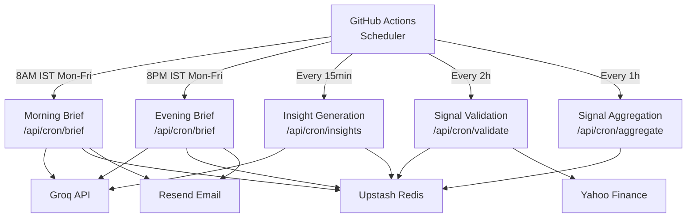

# Data Pipeline Architecture

Stocky Terminal operates 8 real-time data pipelines and 5 scheduled cron jobs that together keep the terminal's data fresh across market data, news, OSINT, and AI signals.

> [!info] No WebSocket (Yet)
> All pipelines currently use polling. WebSocket support for live tick data is planned for Phase 3. The current polling intervals are fast enough for the terminal's use case.

## Real-Time Pipelines

```mermaid
gantt
    title Pipeline Refresh Intervals
    dateFormat X
    axisFormat %s

    section High Frequency
    Ticker (15s)        :a, 0, 15
    Market Data (15s)   :b, 0, 15
    X Feed (2min)       :c, 0, 120

    section Medium Frequency
    Commodities (30s)   :d, 0, 30
    AI Signals (5min)   :e, 0, 300
    YouTube (5min)      :f, 0, 300

    section Low Frequency
    RSS Feeds (15min)   :g, 0, 900
    Weather (30min)     :h, 0, 1800
```

### Pipeline Details

| Pipeline | Interval | Source(s) | Processing | Output |
|---|---|---|---|---|
| **Ticker** | 15s | Zerodha → Dhan → Yahoo | Race pattern, batch fetch | Live quote updates in ticker bar |
| **Market Data** | 15s | Yahoo Finance | Multi-symbol batch | Market overview panel |
| **Commodities** | 30s | Yahoo Finance | Gold, Silver, Crude, Natural Gas, Copper | Commodities panel |
| **RSS Feeds** | 15min | 333+ feeds across 4 tiers | Fetch → parse → classify → filter → score → detect assets → sort → deduplicate | News panel |
| **Weather** | 30min | OpenWeatherMap | Major Indian cities | Weather widget |
| **AI Signals** | 5min | Groq API + cached market data | Insight generation from high-severity headlines | Signals panel |
| **X Feed** | 2min | X API | Financial accounts, market commentary | Social panel |
| **YouTube** | 5min | YouTube API | Finance channels, market analysis | Social panel |

## Cron Job Architecture

All cron jobs run as GitHub Actions workflows that call Vercel Edge Function endpoints:

### Cron Job Details

#### 1. Morning Brief (8:00 AM IST, Mon-Fri)
- Fetches overnight market data: Nifty 50, Sensex, Bank Nifty, 8 sector indices
- Pulls Gift Nifty for pre-market indication
- Gets 8 global indices (S&P 500, Nasdaq, FTSE, DAX, Nikkei, Hang Seng, Shanghai, Kospi)
- Adds 5 commodities (Gold, Silver, Crude, Natural Gas, Copper)
- Adds 5 forex pairs (USD/INR, EUR/USD, GBP/USD, USD/JPY, EUR/INR)
- Adds 5 crypto (BTC, ETH, SOL, XRP, BNB)
- Sends all data to Groq for AI-generated outlook and signals
- Stores in Redis as blog post (HTML in sorted set)
- Emails to 70+ subscribers via Resend
- Increments edition number (read-then-set from Redis)

#### 2. Evening Brief (8:00 PM IST, Mon-Fri)
- Same data collection as morning brief, but with full day's performance
- Includes closing prices and day change percentages
- AI generates end-of-day summary and next-day outlook

#### 3. Insight Generation (Every 15 minutes)
- Scans recent high-severity news headlines
- Generates pre-cached AI insights for assets mentioned
- Stores in Redis with 5-minute TTL

#### 4. Signal Validation (Every 2 hours)
- Fetches all active signals from Redis
- Checks current price against signal's predicted direction
- **>0.5% contradiction:** Signal removed
- **>1.5% strong contradiction:** Direction flipped, confidence reduced by 15
- Preserves original `updatedAt` timestamp

#### 5. Signal Aggregation (Every hour)
- 12-hour lookback window with exponential time decay
- Correlation amplification across 21 asset pairs
- Nifty coherence filtering (signals must align with broad market)
- Previous signals injected with `changeReason` tracking

> [!warning] Weekend Detection
> The brief cron jobs only run Mon-Fri. However, the system also detects stale weekend data: if market data hasn't changed in >18 hours, the UI shows a "Markets Closed" indicator rather than displaying stale prices as current.

## RSS Feed Pipeline Detail

```mermaid
flowchart LR
    FEEDS["333+ RSS Feeds"] --> FETCH["Fetch<br/>(parallel batches)"]
    FETCH --> PARSE["Parse XML<br/>(RSS 2.0 / Atom)"]
    PARSE --> CLASSIFY["Classify<br/>(T1-T4 tier)"]
    CLASSIFY --> FILTER["Filter<br/>(dedup, age)"]
    FILTER --> SCORE["Score<br/>(severity, relevance)"]
    SCORE --> DETECT["Detect Assets<br/>(ticker mentions)"]
    DETECT --> SORT["Sort<br/>(severity + recency)"]
    SORT --> DEDUP["Deduplicate<br/>(Jaccard >0.6)"]
    DEDUP --> OUTPUT["News Panel"]
```

## Related Notes

- [[System Architecture]]
- [[Database & Caching]]
- [[Daily Market Brief]]
- [[Signal Generation & Aggregation]]
- [[Signal Validation]]
- [[News Sentiment System]]
