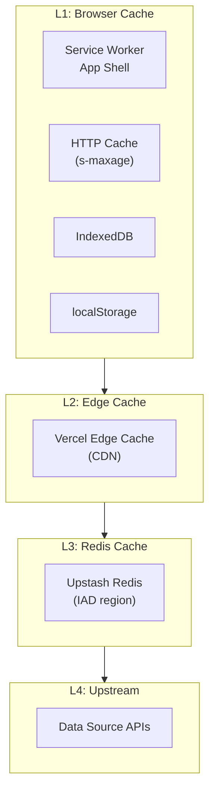

# Database & Caching

Stocky Terminal has no traditional database. All server-side persistence uses Upstash Redis, while client-side state lives in IndexedDB and localStorage.

> [!info] Why No Database?
> A terminal is a real-time data viewer, not a CRUD app. Market data is ephemeral (refreshed every 15s), AI insights have short TTLs, and user preferences are browser-local. Redis is the perfect fit: fast, TTL-native, and serverless.

## Upstash Redis Usage

### Data Structures

| Key Pattern | Type | TTL | Purpose |
|---|---|---|---|
| `blog:posts` | Sorted Set | None | Blog post HTML (score = edition number) |
| `blog:edition` | String | None | Current edition counter |
| `insight:<asset>` | String (JSON) | 5min | Pre-cached AI insights |
| `signals:active` | Sorted Set | 24h | Active trade signals (score = timestamp) |
| `signals:aggregated` | String (JSON) | 1h | Aggregated signal summary |
| `rating:<subscriber>:<edition>` | String | 90 days | Per-subscriber brief rating (1-10) |
| `subscribers` | Set | None | Email subscriber list |
| `zerodha:token` | String | 18h | Zerodha access token (refreshed daily) |

### Blog Post Storage

Blog posts (daily briefs) are stored as HTML in a Redis sorted set, with the edition number as the score:

```typescript
// Writing a new brief
await redis.zadd('blog:posts', {
    score: editionNumber,
    member: JSON.stringify({
        edition: editionNumber,
        type: 'morning' | 'evening',
        html: generatedHTML,
        date: new Date().toISOString(),
        subject: briefSubject,
    })
});
```

> [!warning] Edition Numbering Race Condition
> The edition number uses a read-then-set pattern (`GET` → increment → `SET`). If two cron executions overlap (rare but possible), they could get the same edition number. The fix: use `INCR` for atomic increment instead. See [[Technical Learnings]] for details.

### Rating System

Subscribers rate each brief 1-10. Ratings are stored per-subscriber, per-brief with a 90-day TTL:

```typescript
// Store rating
await redis.set(
    `rating:${subscriberEmail}:${editionNumber}`,
    rating.toString(),
    { ex: 90 * 24 * 60 * 60 } // 90-day TTL
);

// Fetch average rating for an edition
const keys = await redis.keys(`rating:*:${editionNumber}`);
const ratings = await Promise.all(keys.map(k => redis.get(k)));
const avg = ratings.reduce((a, b) => a + Number(b), 0) / ratings.length;
```

### AI Insight Cache

Pre-cached insights from the 15-minute cron job:

```typescript
// Cache insight
await redis.set(
    `insight:${asset}`,
    JSON.stringify({ direction, confidence, reasoning, timestamp }),
    { ex: 300 } // 5-minute TTL
);

// Fetch insight (returns null if expired)
const cached = await redis.get(`insight:${asset}`);
```

## Client-Side Storage

### IndexedDB — Event Store

The client maintains an event store in IndexedDB for analytics and debugging:

```typescript
interface AppEvent {
    id: string;          // UUID
    type: string;        // 'symbol:change', 'panel:open', etc.
    data: unknown;       // Event payload
    timestamp: number;   // Date.now()
}
```

| Setting | Value | Reason |
|---|---|---|
| Max events | 1000 | Prevents unbounded growth |
| Eviction | Oldest first | FIFO when limit reached |
| Database name | `stocky-events` | Single object store |
| Persistence | Across sessions | Survives page refresh |

> [!tip] Why IndexedDB Over localStorage?
> IndexedDB supports structured data, indexing, and larger storage limits (typically 50MB+ vs 5MB for localStorage). The event store benefits from indexed queries by type and timestamp.

### localStorage — Preferences

Simple key-value preferences stored in localStorage:

| Key | Type | Default | Purpose |
|---|---|---|---|
| `stocky:theme` | `'dark' \| 'light'` | `'dark'` | UI theme |
| `stocky:panels` | JSON array | All panels | Visible panels and order |
| `stocky:symbol` | string | `'NIFTY 50'` | Last active symbol |
| `stocky:watchlist` | JSON array | `[]` | User watchlist symbols |
| `stocky:mapLayers` | JSON object | Default layers | Map layer visibility state |
| `stocky:chartType` | `'area' \| 'candle'` | `'area'` | Chart display mode |
| `stocky:timeframe` | string | `'1D'` | Chart timeframe |

## Caching Architecture



**Cache resolution order:**
1. **Service Worker** — Serves cached app shell, tiles, and static assets
2. **HTTP Cache** — `s-maxage` headers let Vercel CDN serve stale data
3. **Upstash Redis** — Server-side cache for API responses and generated content
4. **Upstream API** — Fresh data fetched only on complete cache miss

## Related Notes

- [[System Architecture]]
- [[API Layer Design]]
- [[Daily Market Brief]]
- [[Signal Generation & Aggregation]]
- [[Technical Learnings]]
