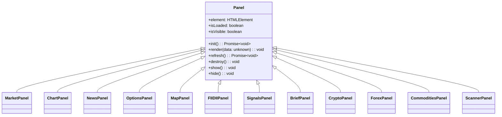

# Frontend Architecture

The Stocky Terminal frontend is a zero-framework vanilla TypeScript application. No React, no Vue, no Angular — just TypeScript compiled by Vite with direct DOM manipulation.

> [!info] Core Principle
> When you know exactly which DOM nodes will change and when, a virtual DOM is overhead, not a feature. Stocky uses targeted patching for surgical updates.

## Panel System

All UI sections extend a base `Panel` class that provides lifecycle management:



### Panel Lifecycle

1. **Registration** — Panel registers with PanelManager on app boot
2. **Lazy Init** — `init()` called only when panel first becomes visible
3. **Render** — `render()` called with fresh data on each update cycle
4. **Refresh** — `refresh()` triggered by timer or user action
5. **Destroy** — `destroy()` cleans up event listeners and timers when panel is removed

## State Management

### AppContext Singleton

```typescript
class AppContext {
    private static instance: AppContext;
    private activeSymbol: string = 'NIFTY 50';
    private marketData: Map<string, MarketData> = new Map();
    private subscribers: Map<string, Set<Function>> = new Map();

    static getInstance(): AppContext;
    setActiveSymbol(symbol: string): void;
    getMarketData(): Map<string, MarketData>;
    subscribe(event: string, callback: Function): void;
    notify(event: string, data: unknown): void;
}
```

> [!tip] No Redux, No Zustand
> A singleton with a simple pub/sub pattern is sufficient for a terminal where data flows in one direction: API → AppContext → Panels. No time-travel debugging needed.

### Custom Event Bus

```typescript
// Emitting events
document.dispatchEvent(new CustomEvent('symbol:change', {
    detail: { symbol: 'TATASTEEL', source: 'watchlist' }
}));

// Listening
document.addEventListener('symbol:change', (e: CustomEvent) => {
    chartPanel.loadSymbol(e.detail.symbol);
});
```

Events used across the application:

| Event | Payload | Fired When |
|---|---|---|
| `symbol:change` | `{ symbol, source }` | User selects a new ticker |
| `market:update` | `{ quotes }` | Fresh market data arrives |
| `theme:change` | `{ theme }` | User toggles dark/light mode |
| `panel:resize` | `{ panelId, width, height }` | Panel drag-resized |
| `brief:loaded` | `{ edition, type }` | Daily brief fetched |
| `signal:new` | `{ signal }` | New trade signal detected |
| `map:layer:toggle` | `{ layer, visible }` | Map layer toggled |

## DOM Update Patterns

### Targeted Patching (patchTableRows)

Instead of re-rendering entire tables, Stocky compares new data against existing DOM nodes and patches only changed cells:

```typescript
function patchTableRows(
    tbody: HTMLTableSectionElement,
    newData: RowData[],
    keyFn: (row: RowData) => string,
    renderRow: (row: RowData) => HTMLTableRowElement
): void {
    const existingRows = new Map<string, HTMLTableRowElement>();
    // Map existing rows by key
    tbody.querySelectorAll('tr').forEach(tr => {
        existingRows.set(tr.dataset.key!, tr as HTMLTableRowElement);
    });

    for (const row of newData) {
        const key = keyFn(row);
        const existing = existingRows.get(key);
        if (existing) {
            // Patch changed cells only
            patchCells(existing, row);
        } else {
            // Insert new row
            tbody.appendChild(renderRow(row));
        }
    }
}
```

### VirtualScroll for News

The news panel uses virtual scrolling to handle 333+ feed items without DOM bloat:

```typescript
class VirtualScroll {
    private container: HTMLElement;
    private itemHeight: number = 72;
    private visibleItems: number;
    private scrollTop: number = 0;
    private allItems: NewsItem[];

    render(): void {
        const startIdx = Math.floor(this.scrollTop / this.itemHeight);
        const endIdx = startIdx + this.visibleItems + 2; // buffer
        // Only render visible items + small buffer
    }
}
```

## Code Splitting

Dynamic `import()` is used to lazy-load heavy modules:

| Module | Trigger | Size |
|---|---|---|
| Map (deck.gl + MapLibre) | User opens OSINT panel | ~120kB |
| TradingView Charts | User opens chart panel | ~35kB |
| Pattern Detection | User enables patterns | ~15kB |
| PDF Generation | User clicks "Download PDF" | ~25kB |

```typescript
// Lazy load map only when needed
async function initMap() {
    const { MapPanel } = await import('./panels/MapPanel');
    const panel = new MapPanel();
    await panel.init();
}
```

## Theming

CSS Custom Properties drive the entire theme system:

```css
:root {
    --bg-primary: #0a0a0f;
    --bg-secondary: #12121a;
    --text-primary: #e8e8ed;
    --text-secondary: #8b8b9e;
    --accent-green: #00ff88;
    --accent-red: #ff4444;
    --border: #1e1e2e;
}

[data-theme="light"] {
    --bg-primary: #ffffff;
    --bg-secondary: #f5f5f7;
    --text-primary: #1a1a1a;
    /* ... */
}
```

> [!warning] No CSS-in-JS
> All styles are in plain CSS files. No styled-components, no Tailwind, no CSS modules. This keeps the build pipeline simple and CSS cacheable.

## Responsive Design

- **ResizeObserver** on every panel for responsive chart/table sizing
- **CSS Grid** for the main layout with named grid areas
- **Media queries** for mobile breakpoints (the PWA works on mobile but is optimized for desktop)
- **Panel collapse** — panels can be minimized to a header bar on smaller screens

## Related Notes

- [[System Architecture]]
- [[Tech Stack]]
- [[Architecture Decisions]]
- [[TradingView Charts]]
- [[PWA & Push Notifications]]
