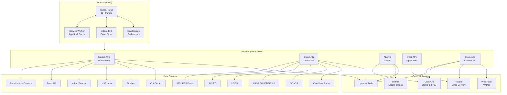
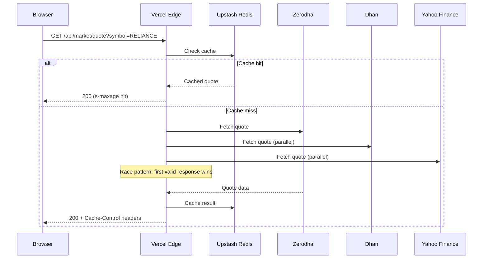

# System Architecture

Stocky Terminal follows a JAMstack-inspired architecture: a static frontend deployed as a PWA communicates with 30+ Vercel Edge Functions that aggregate data from multiple upstream sources, cached via Upstash Redis.

> [!info] Design Principles
> 1. **Edge-first** — All API logic runs at the edge (Vercel Edge Functions), not in a traditional server
> 2. **Cache-heavy** — Redis caching at every layer reduces upstream API calls and latency
> 3. **Graceful degradation** — Race patterns and fallback chains ensure data availability
> 4. **Zero backend state** — No database beyond Redis cache; the client is the source of truth for user preferences

## Full System Architecture

## Request Flow

A typical market data request follows this path:

## Edge Function Regions

| Region | Code | Purpose |
|---|---|---|
| US East (Virginia) | IAD | Default, closest to Upstash Redis |
| Singapore | SIN | Asia-Pacific users |
| Mumbai | BOM | India users, lowest latency to NSE |

## Data Flow Rates

| Pipeline | Interval | Source | Cache TTL |
|---|---|---|---|
| Ticker quotes | 15s | Zerodha/Dhan/Yahoo | 10s edge, 15s Redis |
| Market overview | 15s | Yahoo Finance | 15s |
| Commodities | 30s | Yahoo Finance | 30s |
| RSS feeds | 15min | 333+ feeds | 15min |
| Weather | 30min | OpenWeatherMap | 30min |
| AI signals | 5min | Groq API | 5min |
| X feed | 2min | X API | 2min |
| YouTube | 5min | YouTube API | 5min |

## Cron Job Schedule

| Job | Schedule | Description |
|---|---|---|
| Morning Brief | 8:00 AM IST (Mon-Fri) | Generate + email daily morning brief |
| Evening Brief | 8:00 PM IST (Mon-Fri) | Generate + email daily evening brief |
| Insight Generation | Every 15 minutes | Pre-cache AI insights from high-severity headlines |
| Signal Validation | Every 2 hours | Validate existing signals against live prices |
| Signal Aggregation | Every hour | Aggregate and score trade signals |

> [!warning] Single Point of Failure
> Upstash Redis is the most critical dependency. If Redis is down, the blog, AI insights, signals, email ratings, and edition numbering all fail. The market data APIs can still function (they fall back to upstream sources directly), but caching is lost.

## Security Model

- All Edge Functions validate input parameters
- CORS headers configured for terminal.stockyai.xyz origin
- No user authentication (public terminal) — future consideration
- API keys stored as Vercel environment variables, never in client code
- Zerodha access token refreshed daily via GitHub Actions (never stored in Redis)

## Related Notes

- [[Frontend Architecture]]
- [[API Layer Design]]
- [[Data Pipeline Architecture]]
- [[Database & Caching]]
- [[Deployment]]
- [[Tech Stack]]
