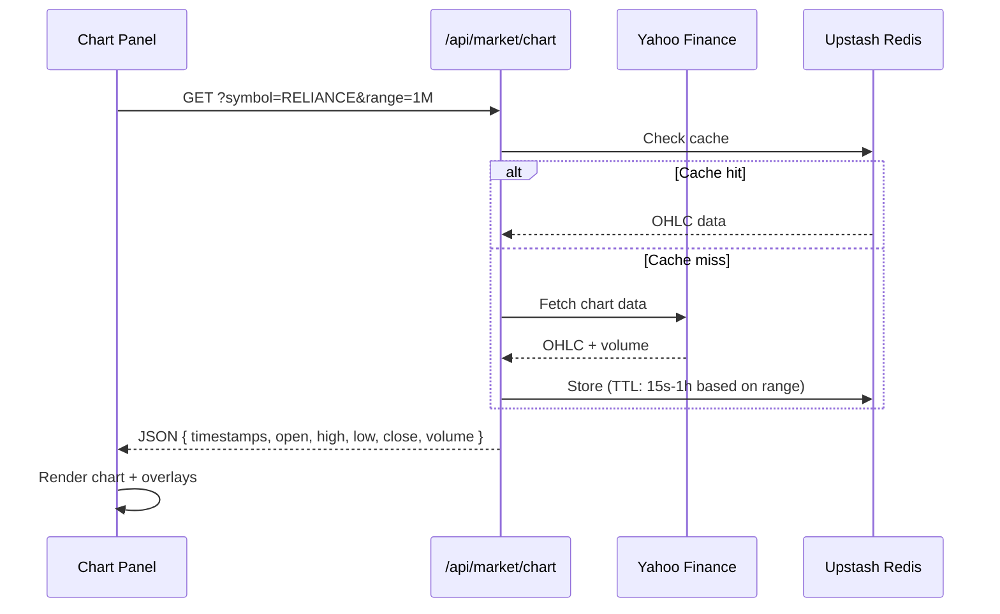

# TradingView Charts

Stocky Terminal uses TradingView's Lightweight Charts library (v5) for all charting — a 35kB gzipped library that renders high-performance financial charts using HTML Canvas.

> [!info] Why Lightweight Charts?
> Full TradingView embeds are heavy (~500kB+) and require iframe integration. Lightweight Charts v5 gives us direct API control, custom styling, and a fraction of the bundle size.

## Chart Modes

### Area Chart (Default)
- Gradient fill from line to bottom
- Green gradient for positive days, red for negative
- Used for the main overview and quick glance at price action

### Candlestick Chart
- Standard OHLC candlesticks with volume histogram overlay
- Green for bullish candles (close > open), red for bearish
- Toggle between modes with a single button

## Timeframes

| Timeframe | Label | Data Points | Source |
|---|---|---|---|
| 1 Day | 1D | ~390 (1-min bars) | Yahoo Finance intraday |
| 1 Week | 1W | ~5 trading days | Yahoo Finance daily |
| 1 Month | 1M | ~22 trading days | Yahoo Finance daily |
| 3 Months | 3M | ~65 trading days | Yahoo Finance daily |
| 1 Year | 1Y | ~250 trading days | Yahoo Finance daily |

## Data Pipeline



## 52-Week High/Low Lines

The chart displays dashed horizontal price lines at the 52-week high and 52-week low:

```typescript
// Add 52W high line
chart.addLineSeries({
    color: '#00ff88',
    lineWidth: 1,
    lineStyle: LineStyle.Dashed,
    priceLineVisible: false,
}).setData([
    { time: firstBar.time, value: fiftyTwoWeekHigh },
    { time: lastBar.time, value: fiftyTwoWeekHigh },
]);
```

These values come from Yahoo Finance's `meta` object in the chart response, which includes `fiftyTwoWeekHigh` and `fiftyTwoWeekLow`.

## Volume Histogram

Volume is displayed as a histogram overlay at the bottom of the chart:

- Green bars when close > open (bullish volume)
- Red bars when close < open (bearish volume)
- Opacity reduced to 50% to not obscure price action
- Separate Y-axis (price scale) from the main chart

## Responsive Sizing

```typescript
// ResizeObserver ensures chart fills its container
const observer = new ResizeObserver(entries => {
    for (const entry of entries) {
        const { width, height } = entry.contentRect;
        chart.resize(width, height);
        chart.timeScale().fitContent();
    }
});
observer.observe(chartContainer);
```

> [!tip] Fit Content
> After every resize, `timeScale().fitContent()` ensures all data points are visible. This prevents the chart from showing blank space after panel resizing.

## Chart Modal

Clicking a chart opens it in a full-screen modal with additional stats:

| Stat | Source | Display |
|---|---|---|
| Current Price | Live quote | Large font, green/red |
| Day Change | Live quote | Absolute + percentage |
| 52W High | Yahoo meta | With distance % |
| 52W Low | Yahoo meta | With distance % |
| 52W Range % | Calculated | Position within range |
| Volume | Yahoo OHLC | With average comparison |
| Market Cap | Yahoo quote | Formatted (Cr/L) |

## Integration with Pattern Detection

When candlestick mode is active, the chart integrates with the [[Candlestick Pattern Detection]] system. Detected patterns are displayed as colored badges below the chart, each clickable to highlight the specific candles involved.

> [!warning] Performance Consideration
> Pattern detection runs browser-side using the `technicalindicators` library. For 1Y timeframes with ~250 data points, detection completes in <10ms. However, scanning multiple symbols in a loop should use `requestIdleCallback` to avoid blocking the UI thread.

## Related Notes

- [[Candlestick Pattern Detection]]
- [[52-Week Scanner]]
- [[Tech Stack]]
- [[Frontend Architecture]]
