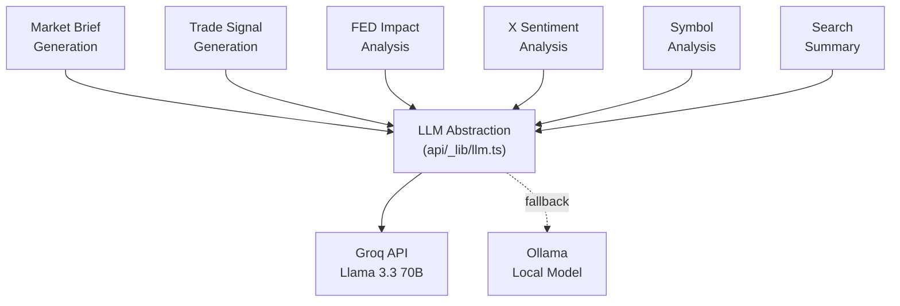

# AI Pipeline

Stocky Terminal's AI layer is powered by Groq's hosted Llama 3.3 70B Versatile model, with Ollama as a local development/fallback option. All AI functions share a common LLM abstraction layer.

> [!info] Why Groq?
> Groq's LPU inference engine delivers 500+ tokens/second for Llama 3.3 70B — 10x faster than typical GPU inference. For a real-time terminal, response speed is critical. Groq's free tier also provides generous daily limits.

## LLM Abstraction Layer

All AI functions go through a shared abstraction at `api/_lib/llm.ts`:

```typescript
interface LLMRequest {
    system: string;
    prompt: string;
    jsonMode?: boolean;
    temperature?: number;
    maxTokens?: number;
}

interface LLMResponse {
    content: string;
    model: string;
    tokens: { prompt: number; completion: number };
    latencyMs: number;
}

async function callLLM(request: LLMRequest): Promise<LLMResponse> {
    try {
        return await callGroq(request);
    } catch (error) {
        console.warn('[LLM] Groq failed, falling back to Ollama');
        return await callOllama(request);
    }
}
```

## AI Functions



### 1. Market Brief Generation
- **Trigger:** 8AM/8PM IST cron job
- **Input:** Aggregated market data (indices, sectors, global, commodities, forex, crypto)
- **Output:** HTML-formatted brief with outlook and signals
- **JSON mode:** No (HTML output)
- **Temperature:** 0.7

### 2. Trade Signal Generation
- **Trigger:** Every 15 minutes (insight cron)
- **Input:** High-severity news headlines + market context + [[Ticker Context System]]
- **Output:** JSON array of signals with direction, confidence, reasoning
- **JSON mode:** Yes
- **Temperature:** 0.3 (more deterministic for signals)

### 3. FED Impact Analysis
- **Trigger:** On-demand when FED-related news detected
- **Input:** FED headline + current Indian market state
- **Output:** Impact analysis on Indian markets (sectors, currency, bonds)
- **JSON mode:** Yes
- **Temperature:** 0.5

### 4. X Sentiment Analysis
- **Trigger:** Every 2 minutes (X feed pipeline)
- **Input:** Batch of recent X posts from financial accounts
- **Output:** Sentiment summary + key themes
- **JSON mode:** Yes
- **Temperature:** 0.3

### 5. Symbol Analysis
- **Trigger:** On-demand when user requests deep analysis
- **Input:** Symbol + recent news + price data + sector context
- **Output:** Comprehensive analysis with bull/bear case
- **JSON mode:** No (markdown output)
- **Temperature:** 0.7

### 6. Search Summary
- **Trigger:** On-demand when user searches
- **Input:** Search query + matching news headlines + market data
- **Output:** Concise summary answering the search query
- **JSON mode:** No
- **Temperature:** 0.5

## Chain-of-Thought

All prompts use chain-of-thought to improve reasoning quality:

```
Think step by step:
1. First, analyze the raw data for each category
2. Identify the 3 most significant moves and their likely causes
3. Look for correlations (e.g., crude up → ONGC up, rupee weak)
4. Consider global context (US markets, FED, geopolitics)
5. Synthesize into actionable insights
```

> [!tip] JSON Mode
> For structured outputs (signals, analysis), Groq's JSON mode ensures valid JSON responses. The prompt includes a JSON schema example, and `response_format: { type: "json_object" }` is set in the API call.

## Cost Analysis

| Function | Calls/Day | Avg Tokens | Daily Cost (Groq Free) |
|---|---|---|---|
| Market Brief | 2 | ~3,000 | $0 (free tier) |
| Trade Signals | 96 (every 15min) | ~1,000 | $0 (free tier) |
| FED Impact | ~2 | ~1,500 | $0 (free tier) |
| X Sentiment | 720 (every 2min) | ~500 | $0 (free tier) |
| Symbol Analysis | ~20 | ~2,000 | $0 (free tier) |
| Search Summary | ~50 | ~800 | $0 (free tier) |

> [!warning] Groq Rate Limits
> Groq's free tier has rate limits (requests/minute and tokens/day). The 15-minute insight cron and 2-minute X sentiment pipeline are the heaviest consumers. If limits are hit, Ollama fallback activates, but response quality may degrade with smaller local models.

## Ollama Fallback

For development and Groq outages:

```typescript
async function callOllama(request: LLMRequest): Promise<LLMResponse> {
    const response = await fetch('http://localhost:11434/api/generate', {
        method: 'POST',
        body: JSON.stringify({
            model: 'llama3.1:8b',  // Smaller model for local
            system: request.system,
            prompt: request.prompt,
            format: request.jsonMode ? 'json' : undefined,
            options: { temperature: request.temperature ?? 0.7 },
        }),
    });
    // Parse streaming response...
}
```

## Related Notes

- [[Signal Generation & Aggregation]]
- [[Signal Validation]]
- [[Ticker Context System]]
- [[Daily Market Brief]]
- [[Tech Stack]]
- [[Architecture Decisions]]
