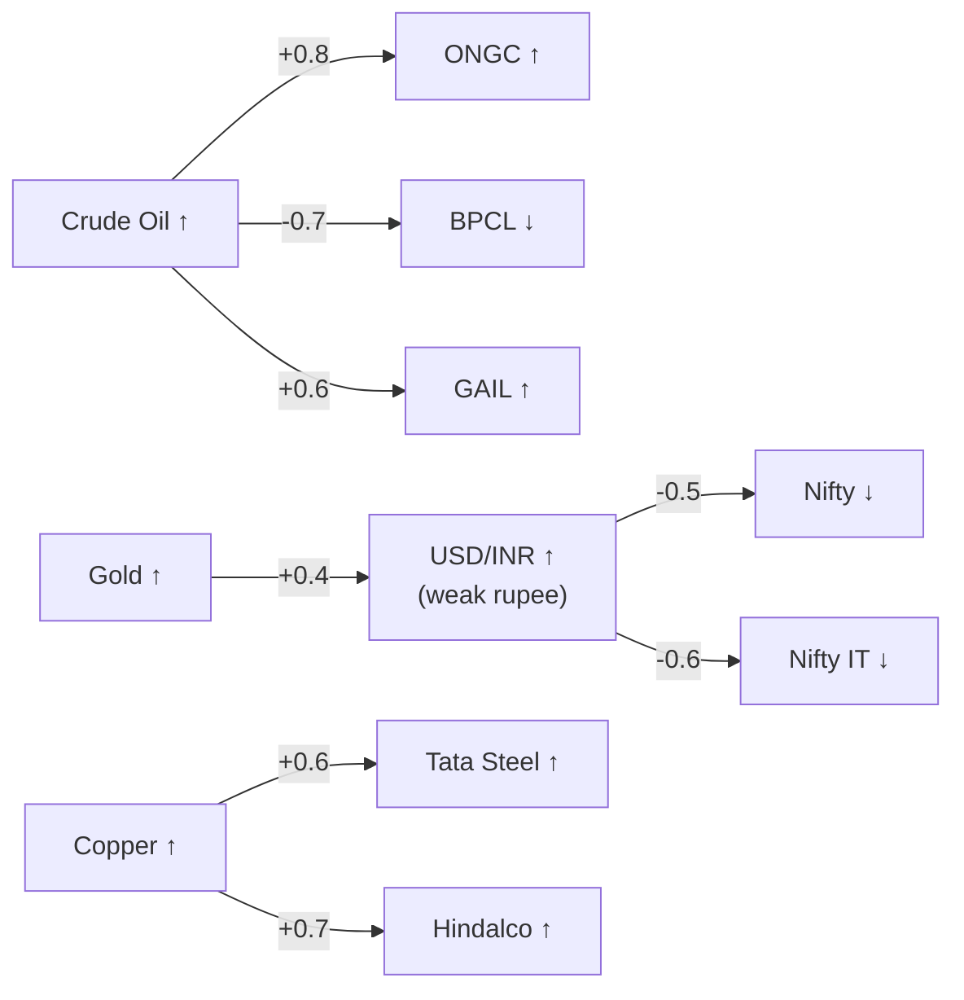

# Ticker Context System

The Ticker Context System provides static domain knowledge about 15 major Indian assets to the AI pipeline. This context is injected into LLM prompts so the model understands sector dynamics, revenue drivers, and inter-asset relationships.

> [!info] Why Static Context?
> LLMs have general knowledge but lack specificity about Indian companies' revenue structures and sector correlations. For example, without context, the model might not know that BPCL is hurt by rising crude prices (as a refiner/retailer, not a producer). Static context fixes these blind spots.

## Covered Assets

| Ticker | Company / Asset | Type | Sector |
|---|---|---|---|
| ONGC | Oil & Natural Gas Corp | Stock | Energy (Upstream) |
| BPCL | Bharat Petroleum | Stock | Energy (Downstream) |
| GAIL | GAIL India | Stock | Energy (Gas Distribution) |
| RELIANCE | Reliance Industries | Stock | Conglomerate |
| TATASTEEL | Tata Steel | Stock | Metals |
| HINDALCO | Hindalco Industries | Stock | Metals (Aluminum) |
| TCS | Tata Consultancy Services | Stock | IT Services |
| INFY | Infosys | Stock | IT Services |
| HDFCBANK | HDFC Bank | Stock | Banking |
| ICICIBANK | ICICI Bank | Stock | Banking |
| SBIN | State Bank of India | Stock | Banking (PSU) |
| NIFTY 50 | Nifty 50 Index | Index | Broad Market |
| BANK NIFTY | Bank Nifty Index | Index | Banking Sector |
| GOLD | Gold | Commodity | Precious Metal |
| CRUDE OIL | Brent Crude | Commodity | Energy |

## Context Structure

```typescript
interface TickerContext {
    type: 'stock' | 'index' | 'commodity';
    revenueDrivers: string[];
    benefitsFrom: string[];
    hurtsFrom: string[];
    correlatedAssets: string[];
    notes?: string;
}

const TICKER_CONTEXT: Record<string, TickerContext> = {
    'ONGC': {
        type: 'stock',
        revenueDrivers: [
            'Crude oil production (upstream)',
            'Natural gas production',
            'Government-mandated gas pricing',
        ],
        benefitsFrom: [
            'Rising crude oil prices',
            'Rising natural gas prices',
            'Weak INR (dollar-denominated revenue)',
            'Geopolitical supply disruptions',
        ],
        hurtsFrom: [
            'Falling crude oil prices',
            'Government subsidy burden',
            'Rising operating costs',
            'Environmental regulations',
        ],
        correlatedAssets: ['CRUDE_OIL', 'GAIL', 'BPCL'],
        notes: 'India largest oil producer. Often confused with downstream companies like BPCL.',
    },
    'BPCL': {
        type: 'stock',
        revenueDrivers: [
            'Petroleum refining and retail',
            'Fuel retail network (petrol pumps)',
            'LPG distribution',
        ],
        benefitsFrom: [
            'Falling crude oil prices (lower input cost)',
            'Strong domestic fuel demand',
            'Favorable refining margins (GRMs)',
            'Government deregulation of fuel prices',
        ],
        hurtsFrom: [
            'Rising crude oil prices (input cost pressure)',
            'Government-mandated price freezes',
            'Weak INR (imports crude in USD)',
        ],
        correlatedAssets: ['CRUDE_OIL', 'ONGC', 'GAIL'],
        notes: 'Downstream refiner — opposite crude correlation to ONGC.',
    },
    // ... 13 more assets with similar detail
};
```

## Injection into Prompts

When the AI pipeline generates signals or analysis for a specific asset, the ticker context is appended:

```typescript
function buildPrompt(asset: string, headlines: string[], marketData: object): string {
    let prompt = `Analyze the following headlines and market data for ${asset}:\n`;
    prompt += headlines.join('\n');

    const context = TICKER_CONTEXT[asset];
    if (context) {
        prompt += `\n\nAsset Context for ${asset}:`;
        prompt += `\n- Type: ${context.type}`;
        prompt += `\n- Revenue Drivers: ${context.revenueDrivers.join(', ')}`;
        prompt += `\n- Benefits From: ${context.benefitsFrom.join(', ')}`;
        prompt += `\n- Hurts From: ${context.hurtsFrom.join(', ')}`;
        if (context.notes) prompt += `\n- Important: ${context.notes}`;
    }

    return prompt;
}
```

> [!tip] The ONGC Fix
> Before the ticker context system, the AI would sometimes generate bullish ONGC signals when crude prices were falling — confusing ONGC (upstream producer that benefits from high crude) with downstream refiners. Adding the context with explicit "benefitsFrom: Rising crude oil prices" fixed this entirely. See [[Technical Learnings]] for more.

## Correlation Matrix

The ticker context feeds into the [[Signal Generation & Aggregation]] correlation amplification:



> [!warning] Static Context Limitations
> The ticker context is manually maintained. When company dynamics change (e.g., Reliance shifting revenue mix from energy to telecom), the context needs manual updating. A future improvement would be to periodically regenerate context from recent earnings transcripts.

## Related Notes

- [[AI Pipeline]]
- [[Signal Generation & Aggregation]]
- [[Technical Learnings]]
- [[Code Audit Fixes]]
