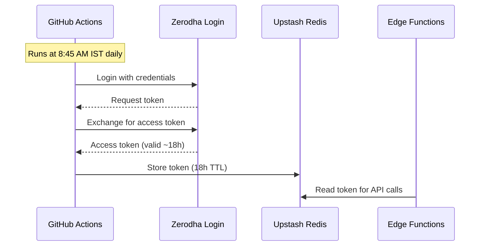

# Market Data Sources

Stocky Terminal aggregates market data from 9 different sources, each serving a specific purpose with fallback chains for reliability.

> [!info] Multi-Source Strategy
> No single free/affordable API covers all of India's market data needs. Stocky combines multiple sources, each chosen for its strengths, with race patterns and fallbacks for reliability.

## Source Matrix

| Source | Data Type | Auth | Rate Limit | Reliability | Notes |
|---|---|---|---|---|---|
| **Zerodha Kite Connect** | NSE/BSE live quotes | API key + daily token | 3 req/sec | High (market hours) | Primary for Indian stocks |
| **Dhan API** | Options chain, quotes | API key | Generous | High | Primary for options |
| **Yahoo Finance** | Global quotes, OHLC, crypto | None (scraping) | ~2000/hour | Medium | Universal fallback |
| **NSE India** | FII/DII, Gift Nifty, corporate actions | Session cookie | Low | Medium | Requires cookie dance |
| **Finnhub** | Global market data, news | API key | 60 req/min | High | Supplementary quotes |
| **Twelve Data** | Historical data, forex | API key | 800 req/day | High | Forex and historical |
| **CoinGecko** | 25 cryptocurrencies | None (free tier) | 10-50 req/min | High | Primary for crypto |
| **Frankfurter** | EUR/USD and major forex | None | Unlimited | High | ECB exchange rates |
| **CurrencyFreaks** | USD/INR and exotic pairs | API key | 1000 req/month | High | Indian forex focus |
| **Forex Factory** | Economic calendar | Scraping | Low | Medium | Upcoming events |

## Zerodha Kite Connect

### Daily Token Refresh

Zerodha's Kite Connect API requires a daily access token that must be generated through a login flow. Stocky automates this via GitHub Actions:



> [!warning] Token Expiry
> If the GitHub Actions workflow fails (Zerodha maintenance, credential rotation), the token expires and all Zerodha-sourced quotes fall back to Dhan/Yahoo. An alert is sent via push notification when this happens.

### Data Available

- Real-time NSE/BSE quotes (LTP, OHLC, volume)
- Market depth (top 5 bids/asks)
- Historical candle data (1min to 1day)
- Instrument master (all NSE/BSE symbols)

## Yahoo Finance

### Cache-Busting

Yahoo Finance occasionally returns cached/stale responses. Stocky uses cache-busting techniques:

```typescript
const url = `https://query1.finance.yahoo.com/v8/finance/chart/${symbol}?` +
    `range=${range}&interval=${interval}&_=${Date.now()}`;
// The _=timestamp parameter busts Yahoo's CDN cache
```

### Data Available

- OHLC chart data (1D to 5Y)
- Quote summary (price, change, market cap, 52W range)
- Global indices (S&P 500, Nasdaq, etc.)
- Commodities (Gold, Silver, Crude)
- Crypto (via Yahoo's crypto symbols)

## NSE India (Gift Nifty)

Gift Nifty (Gujarat International Finance Tec-City Nifty) provides pre-market and after-hours Nifty futures pricing. It requires NSE India's session cookie pattern:

```typescript
// Step 1: Get session cookies
const session = await fetch('https://www.nseindia.com', {
    headers: { 'User-Agent': 'Mozilla/5.0 ...' }
});
const cookies = session.headers.get('set-cookie');

// Step 2: Use cookies for API call
const data = await fetch('https://www.nseindia.com/api/liveEquity/...', {
    headers: {
        'Cookie': cookies,
        'User-Agent': 'Mozilla/5.0 ...',
    }
});
```

> [!tip] Gift Nifty Importance
> Gift Nifty is the single best predictor of where Indian markets will open. The morning brief uses it to set expectations, and the AI pipeline weighs it heavily in pre-market signal generation.

## CoinGecko (Crypto)

25 cryptocurrencies tracked:

| Tier | Coins |
|---|---|
| Major | BTC, ETH, BNB, SOL, XRP |
| Large Cap | ADA, DOGE, DOT, AVAX, LINK |
| Mid Cap | MATIC, SHIB, UNI, ATOM, FIL |
| India Focus | WRX (WazirX), MATIC (Polygon/India) |
| Others | LTC, BCH, APT, ARB, OP, NEAR, FTM, INJ |

## Related Notes

- [[API Layer Design]]
- [[API Endpoint Reference]]
- [[India-Specific APIs]]
- [[Technical Learnings]]
- [[Data Pipeline Architecture]]
