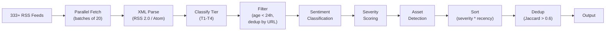

# News & Intelligence Sources

Stocky Terminal ingests 333+ RSS feeds organized into 4 tiers, processed through a multi-stage pipeline that classifies, scores, deduplicates, and detects asset mentions.

> [!info] Feed Count
> The 333+ feed count includes individual RSS feed URLs. Some sources have multiple feeds (e.g., Reuters has separate feeds for business, markets, world, technology). The actual number of unique source organizations is approximately 50.

## Feed Tiers

### Tier 1 — Wire Services (Highest Priority)

| Source | Feeds | Focus |
|---|---|---|
| **Reuters** | 5 | Business, Markets, World, India, Technology |
| **Bloomberg** | 3 | Markets, Economics, Technology |
| **Associated Press** | 2 | Business, World |

> Wire services break news first. T1 sources get 3x weight in severity scoring.

### Tier 2 — Major Publications

| Source | Feeds | Focus |
|---|---|---|
| **CNBC** | 4 | Markets, Economy, Tech, World |
| **Economic Times** | 6 | Markets, Industry, Tech, Economy, Mutual Funds, Startups |
| **BBC** | 3 | Business, World, Asia |
| **Moneycontrol** | 5 | Markets, Stocks, MF, Economy, Commodities |
| **MarketWatch** | 3 | Markets, Economy, Personal Finance |
| **Financial Times** | 2 | Markets, Companies |
| **Wall Street Journal** | 3 | Markets, Economy, Asia |
| **CNBC-TV18** | 4 | Markets, Economy, Companies, Budget |
| **Livemint** | 3 | Markets, Money, Industry |

> T2 sources get 2x weight.

### Tier 3 — Specialty Sources

| Source | Feeds | Focus |
|---|---|---|
| **OilPrice.com** | 2 | Crude oil, energy markets |
| **Kitco** | 2 | Gold, precious metals |
| **DefenseOne** | 1 | Defense industry, geopolitics |
| **Mining.com** | 1 | Mining, metals, commodities |
| **TechCrunch** | 2 | Startups, funding |
| **The Register** | 1 | Tech industry |
| **Semiconductor Engineering** | 1 | Chip industry |
| **Seeking Alpha** | 3 | Stock analysis, dividends, ETFs |

> T3 sources get 1.5x weight.

### Tier 4 — Regional & Specialty

| Source | Feeds | Focus |
|---|---|---|
| **TASS** | 1 | Russia (state media — flagged) |
| **Business Today** | 2 | India business |
| **India Today** | 2 | India general news |
| **The Hindu** | 2 | India, business |
| **South China Morning Post** | 2 | Asia, China |
| **Al Jazeera** | 2 | Middle East, World |
| **Nikkei Asia** | 1 | Japan, Asia markets |
| **Korea Herald** | 1 | South Korea |

> T4 sources get 1x weight.

## Processing Pipeline

### Stage Details

**1. Fetch** — Parallel batches of 20 feeds with 5-second timeout per feed. Failed feeds are skipped silently.

**2. Parse** — Supports both RSS 2.0 (`<item>`) and Atom (`<entry>`) formats. Extracts title, link, published date, description, source.

**3. Classify** — Source URL mapped to tier. Unknown sources default to T4.

**4. Filter** — Remove items older than 24 hours. Deduplicate by URL (exact match).

**5. Sentiment** — Keyword-based classification (see [[News Sentiment System]]).

**6. Severity** — Score 1-10 based on tier weight, keyword strength, recency.

**7. Asset Detection** — Regex matching for ticker symbols, company names, index names, commodity names.

**8. Sort** — Primary: severity (descending). Secondary: publish time (descending).

**9. Dedup** — Jaccard similarity on title text. Threshold > 0.6 = duplicate. Keep highest-tier version.

## State Media Flagging

See [[Source Propaganda Flagging]] for the 10 flagged state media sources that receive an orange "State Media" badge.

> [!warning] RSS Feed Reliability
> RSS feeds can go down, change URLs, or stop updating without notice. The pipeline logs fetch failures but does not alert on individual feed outages. A weekly health check comparing active feeds against the configured list would be a useful addition.

> [!tip] Asset Detection Accuracy
> Asset detection uses a combination of:
> 1. Exact ticker match (e.g., "RELIANCE" in uppercase)
> 2. Company name match (e.g., "Reliance Industries")
> 3. Index name match (e.g., "Nifty 50", "Sensex")
> 4. Commodity name match (e.g., "gold prices", "crude oil")
>
> False positives are possible (e.g., "gold standard" matching GOLD), but the severity scoring system naturally deprioritizes irrelevant mentions.

## Related Notes

- [[News Sentiment System]]
- [[Source Propaganda Flagging]]
- [[Data Pipeline Architecture]]
- [[Signal Generation & Aggregation]]
- [[AI Pipeline]]
