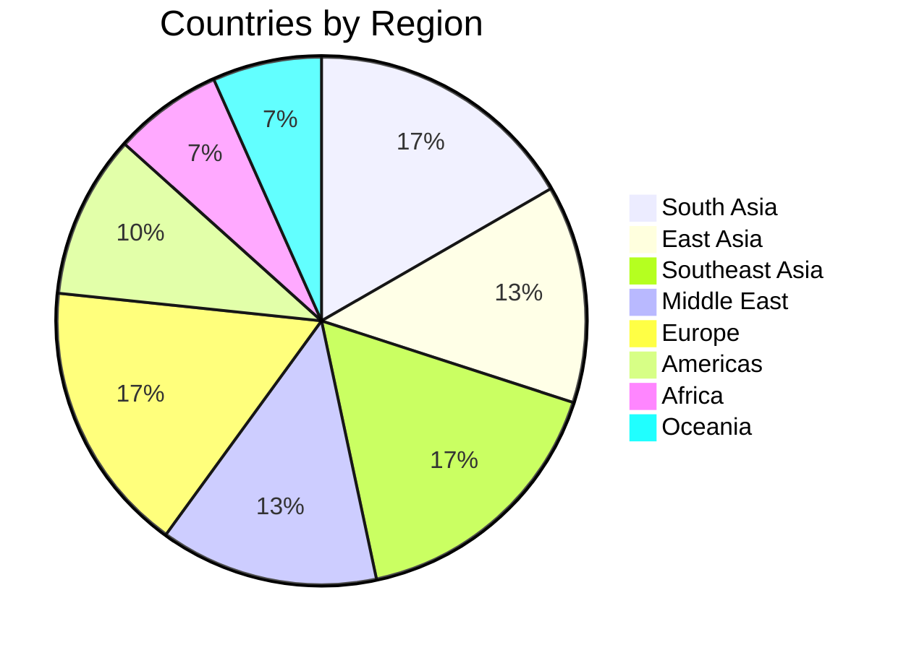

# Country Dossier

The Country Dossier feature provides a one-click intelligence profile for any of 30 countries, accessed by clicking on the OSINT map. Each dossier focuses on the country's economic relationship with India.

> [!info] Access
> Click any country on the [[Map System]] → Nominatim reverse geocode identifies the country → Dossier panel slides open with full profile.

## Reverse Geocode Flow

When a user clicks the map:

```typescript
async function onMapClick(lat: number, lng: number): Promise<void> {
    // Reverse geocode using OpenStreetMap's Nominatim
    const geo = await fetch(
        `https://nominatim.openstreetmap.org/reverse?lat=${lat}&lon=${lng}&format=json`
    ).then(r => r.json());

    const countryCode = geo.address?.country_code?.toUpperCase();
    if (!countryCode) return;

    // Fetch country profile
    const profile = await fetch(`/api/data/country-profile?country=${countryCode}`).then(r => r.json());

    // Render dossier panel
    renderDossier(profile);
}
```

## Dossier Contents

### Economic Overview

| Field | Example (USA) |
|---|---|
| GDP (Nominal) | $25.5 Trillion |
| GDP Growth | 2.1% |
| Population | 331 Million |
| Currency | US Dollar (USD) |
| Inflation (CPI) | 3.2% |
| Credit Rating | AAA (S&P) |

### Bilateral Trade with India

| Field | Example (USA) |
|---|---|
| Total Trade Volume | $128 Billion |
| India's Exports to USA | $78 Billion |
| India's Imports from USA | $50 Billion |
| Trade Balance | +$28 Billion (India surplus) |

### Top Exports to India

| Rank | Category | Value |
|---|---|---|
| 1 | Petroleum & Energy | $12.3B |
| 2 | Machinery & Equipment | $8.7B |
| 3 | Precious Metals | $6.2B |
| 4 | Chemicals | $4.8B |
| 5 | Aircraft & Parts | $3.1B |

### Top Imports from India

| Rank | Category | Value |
|---|---|---|
| 1 | IT Services & Software | $15.2B |
| 2 | Pharmaceuticals | $9.8B |
| 3 | Gems & Jewelry | $8.4B |
| 4 | Textiles & Apparel | $7.1B |
| 5 | Chemicals | $5.6B |

### Political Stability

A composite score derived from World Bank governance indicators:

| Score Range | Label | Visual |
|---|---|---|
| 80-100 | Very Stable | Green |
| 60-79 | Stable | Light Green |
| 40-59 | Moderate | Yellow |
| 20-39 | Unstable | Orange |
| 0-19 | Highly Unstable | Red |

### FDI Flow

| Direction | Value |
|---|---|
| FDI from [Country] to India | $X Billion |
| FDI from India to [Country] | $Y Billion |
| Key Sectors | Technology, Pharma, Manufacturing |

## 30 Countries Covered



> [!tip] India-Centric Analysis
> Every dossier is framed from India's perspective: how does this country's economy affect Indian markets? Trade data, FDI flows, and political stability are all analyzed for their impact on Indian equities, currency, and commodities.

## Dossier Panel UI

The dossier opens as a slide-out panel on the right side of the map:

- **Header:** Country flag + name + quick stats (GDP, population)
- **Tabs:** Overview | Trade | Politics | Companies
- **Charts:** Trade balance bar chart, FDI trend line
- **Related News:** Filtered news from [[News & Intelligence Sources]] mentioning this country

> [!warning] Data Currency
> Country profile data is updated quarterly at best. GDP, trade volumes, and FDI figures are typically 1-2 quarters behind real-time. The profile clearly labels the data vintage (e.g., "Data as of Q3 2025").

## Related Notes

- [[Map System]]
- [[India-Specific APIs]]
- [[OSINT Data Sources]]
- [[News & Intelligence Sources]]
