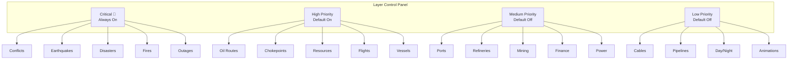
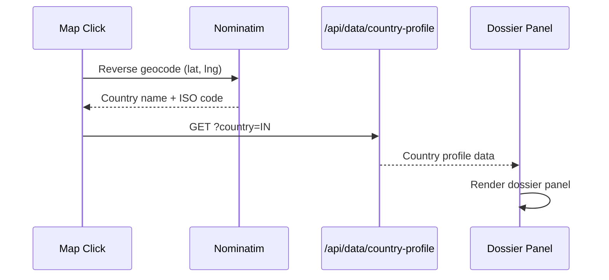

# Map System

The OSINT map is built with deck.gl + MapLibre GL JS, rendering 27+ data layers covering armed conflicts, natural disasters, infrastructure, and transportation. It is the most visually impressive and unique feature of Stocky Terminal.

> [!info] Why deck.gl?
> deck.gl is a WebGL-powered visualization framework that can render millions of data points at 60fps. Combined with MapLibre GL JS (open-source Mapbox alternative), it provides a free, high-performance map engine without Mapbox's pricing.

## Layer Architecture

Layers are organized by priority level, which determines default visibility and rendering order:

### Critical Priority (Always Visible)

| Layer | Source | Visualization | Update |
|---|---|---|---|
| **Armed Conflicts** | ACLED | Red pulsing circles, size = severity | Daily |
| **War Zones** | ACLED (filtered) | Red shaded regions | Daily |
| **Earthquakes** | USGS | Concentric circles, size = magnitude | Real-time |
| **GDACS Disasters** | GDACS | Alert-colored markers (R/O/G) | Near-real-time |
| **Active Fires** | NASA FIRMS | Orange heat points | Every 3h |
| **Internet Outages** | Cloudflare Radar | Country-level red shading | Hourly |

### High Priority (Default On)

| Layer | Source | Visualization | Update |
|---|---|---|---|
| **Oil Routes** | Static | Blue animated lines (major tanker routes) | Static |
| **Chokepoints** | Static | Red markers (Hormuz, Suez, Malacca, etc.) | Static |
| **Natural Resources** | Static | Icons by type (oil, gas, minerals, rare earth) | Static |
| **Flight Tracking** | OpenSky | Aircraft icons with heading | 10s |
| **Vessel Tracking** | AIS | Ship icons on routes | 1-5min |

### Medium Priority (Default Off)

| Layer | Source | Visualization | Update |
|---|---|---|---|
| **Ports** | Static | Blue anchor icons | Static |
| **Refineries** | Static | Factory icons | Static |
| **Mining Sites** | Static | Pickaxe icons | Static |
| **Financial Centers** | Static | Dollar icons | Static |
| **Power Grid** | Static | Yellow lines (major transmission) | Static |

### Low Priority (Default Off)

| Layer | Source | Visualization | Update |
|---|---|---|---|
| **Submarine Cables** | Static | Thin blue lines | Static |
| **Pipelines** | Static | Thin green lines (oil), orange (gas) | Static |
| **Day/Night Terminator** | Calculated | Shadow overlay | Real-time |
| **Animations** | Particle engine | Ambient particles on routes | Continuous |

## Particle Engine

The map includes a custom particle engine for animated effects:

```typescript
class ParticleEngine {
    private particles: Particle[] = [];
    private readonly MAX_PARTICLES = 5000;

    addRoute(start: [number, number], end: [number, number], color: string): void {
        // Create particles that flow along the route
        const count = Math.ceil(this.getDistance(start, end) / 100);
        for (let i = 0; i < count; i++) {
            this.particles.push({
                position: this.interpolate(start, end, i / count),
                velocity: this.getRouteVelocity(start, end),
                color,
                opacity: 0.6 + Math.random() * 0.4,
                size: 2 + Math.random() * 3,
            });
        }
    }
}
```

Particles are used for:
- **Oil tanker routes** — Blue particles flowing along major shipping lanes
- **Submarine cables** — Cyan pulses along undersea cable paths
- **Pipeline flows** — Green/orange particles showing gas/oil flow direction

## Layer Toggle Panel



Layer visibility state is persisted in localStorage (`stocky:mapLayers`).

## Performance Optimization

| Technique | Purpose |
|---|---|
| **Lazy loading** | Map module (~120kB) loaded only when panel opened |
| **Level of Detail** | Fewer details at low zoom, full detail on zoom in |
| **Layer culling** | Off-screen layers are not rendered |
| **Data decimation** | ACLED data reduced by region at low zoom |
| **requestAnimationFrame** | Particle engine synced to display refresh |
| **WebGL instancing** | deck.gl uses instanced rendering for icons |

> [!tip] Mobile Performance
> On mobile devices, particle animations are disabled and flight/vessel update intervals are doubled (20s/10min) to conserve battery and reduce GPU load.

## Country Click → Dossier

Clicking any country on the map triggers the [[Country Dossier]] flow:



> [!warning] Lazy-Load Timing
> The map module is the largest in the application (~120kB). A known issue exists where the map initialization races with tile loading, causing a brief flash of unstyled map. See [[Code Audit Fixes]] for the timing fix.

## Related Notes

- [[OSINT Data Sources]]
- [[Country Dossier]]
- [[Tech Stack]]
- [[Frontend Architecture]]
- [[Code Audit Fixes]]
