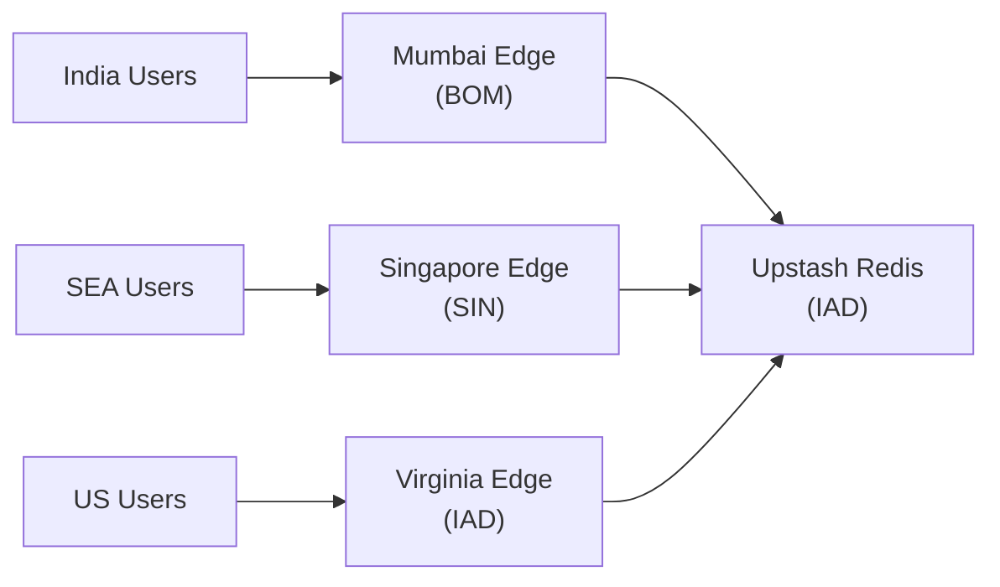

# Deployment

Stocky Terminal deploys to Vercel's edge network with GitHub Actions handling scheduled cron jobs and the Zerodha token refresh workflow.

> [!info] Deployment Model
> Push to `main` → Vercel auto-deploys → Edge functions go live globally within ~30s. No CI/CD pipeline beyond Vercel's built-in build + deploy.

## Vercel Configuration

### Edge Regions

| Region | Code | Purpose | Latency to NSE |
|---|---|---|---|
| US East (Virginia) | IAD | Default region, Upstash Redis proximity | ~180ms |
| Singapore | SIN | Asia-Pacific users | ~60ms |
| Mumbai | BOM | India users, NSE/BSE proximity | ~10ms |



### Edge Caching

Vercel's edge cache serves as L2 cache (between browser and Redis):

```typescript
// Response with edge caching
return new Response(JSON.stringify(data), {
    headers: {
        'Content-Type': 'application/json',
        'Cache-Control': 's-maxage=15, stale-while-revalidate=30',
        'CDN-Cache-Control': 'max-age=15',
    }
});
```

## GitHub Actions Workflows

### 1. Zerodha Token Refresh

```yaml
name: Zerodha Token Refresh
on:
  schedule:
    - cron: '15 3 * * 1-5'  # 8:45 AM IST, Mon-Fri
  workflow_dispatch:

jobs:
  refresh:
    runs-on: ubuntu-latest
    steps:
      - name: Login to Zerodha
        run: |
          # Automated login flow
          # Exchange request token for access token
          # Store in Upstash Redis with 18h TTL
```

### 2. Morning Brief

```yaml
name: Morning Brief
on:
  schedule:
    - cron: '30 2 * * 1-5'  # 8:00 AM IST, Mon-Fri
```

### 3. Evening Brief

```yaml
name: Evening Brief
on:
  schedule:
    - cron: '30 14 * * 1-5'  # 8:00 PM IST, Mon-Fri
```

### 4. Insight Generation

```yaml
name: Insight Generation
on:
  schedule:
    - cron: '*/15 * * * *'  # Every 15 minutes
```

### 5. Signal Validation + Aggregation

```yaml
name: Signal Pipeline
on:
  schedule:
    - cron: '0 */1 * * *'   # Aggregation: every hour
    - cron: '30 */2 * * *'  # Validation: every 2 hours
```

## Security Headers

All responses include security headers:

| Header | Value | Purpose |
|---|---|---|
| `Strict-Transport-Security` | `max-age=31536000; includeSubDomains` | Force HTTPS |
| `X-Content-Type-Options` | `nosniff` | Prevent MIME sniffing |
| `X-Frame-Options` | `DENY` | Prevent clickjacking |
| `Referrer-Policy` | `strict-origin-when-cross-origin` | Control referrer data |
| `Permissions-Policy` | `camera=(), microphone=(), geolocation=()` | Restrict browser features |

```typescript
// Applied via Vercel middleware or per-response
const SECURITY_HEADERS = {
    'Strict-Transport-Security': 'max-age=31536000; includeSubDomains',
    'X-Content-Type-Options': 'nosniff',
    'X-Frame-Options': 'DENY',
    'Referrer-Policy': 'strict-origin-when-cross-origin',
    'Permissions-Policy': 'camera=(), microphone=(), geolocation=()',
};
```

## Environment Variables

| Variable | Service | Stored In |
|---|---|---|
| `UPSTASH_REDIS_REST_URL` | Upstash Redis | Vercel env |
| `UPSTASH_REDIS_REST_TOKEN` | Upstash Redis | Vercel env |
| `GROQ_API_KEY` | Groq AI | Vercel env |
| `RESEND_API_KEY` | Resend email | Vercel env |
| `DHAN_ACCESS_TOKEN` | Dhan API | Vercel env |
| `VAPID_PUBLIC_KEY` | Web Push | Vercel env |
| `VAPID_PRIVATE_KEY` | Web Push | Vercel env |
| `CRON_SECRET` | Cron auth | Vercel env + GitHub Secrets |
| `ZERODHA_API_KEY` | Zerodha | GitHub Secrets |
| `ZERODHA_API_SECRET` | Zerodha | GitHub Secrets |
| `ZERODHA_USER_ID` | Zerodha | GitHub Secrets |
| `ZERODHA_PASSWORD` | Zerodha | GitHub Secrets |
| `ZERODHA_TOTP_KEY` | Zerodha | GitHub Secrets |

> [!warning] Zerodha Credentials
> Zerodha credentials are stored ONLY in GitHub Secrets (for the token refresh workflow), never in Vercel env variables. The access token (short-lived, 18h) is stored in Redis. This limits blast radius if any single service is compromised.

> [!tip] Zero Downtime Deploys
> Vercel's edge deployment model means zero downtime on deploy. New edge functions are deployed atomically — there's no rolling update window where some requests hit old code and others hit new code.

## Service Worker Update

After deployment, the service worker detects the new version:

```typescript
// In service worker
self.addEventListener('install', (event) => {
    self.skipWaiting(); // Activate new SW immediately
});

self.addEventListener('activate', (event) => {
    event.waitUntil(
        // Clean old caches
        caches.keys().then(keys =>
            Promise.all(keys
                .filter(key => key !== CURRENT_CACHE)
                .map(key => caches.delete(key))
            )
        )
    );
    self.clients.claim(); // Take control of all tabs
});
```

## Related Notes

- [[System Architecture]]
- [[Database & Caching]]
- [[PWA & Push Notifications]]
- [[SEO & AI Discoverability]]
- [[Technical Learnings]]
