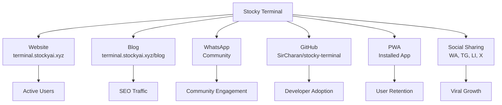

# Distribution Channels

Stocky Terminal reaches users through 6 primary distribution channels, each serving a different audience segment and purpose.

> [!info] Growth Philosophy
> Stocky is an open-source project. Growth comes from utility, not marketing spend. Every distribution channel is free and community-driven.

## Channel Overview



## Channels

### 1. Website (terminal.stockyai.xyz)

| Aspect | Detail |
|---|---|
| **Purpose** | Primary access point |
| **Audience** | Retail traders, investors, analysts |
| **Content** | Live terminal with all panels |
| **SEO** | Optimized with Schema.org, sitemap, meta tags |
| **Performance** | <2s initial load, PWA-capable |

### 2. Blog (terminal.stockyai.xyz/blog)

| Aspect | Detail |
|---|---|
| **Purpose** | SEO acquisition + brief archive |
| **Audience** | Google/Bing searchers |
| **Content** | Daily briefs (morning + evening, Mon-Fri) |
| **Frequency** | 2 posts/day on trading days (~500/year) |
| **SEO Value** | Long-tail keywords from market analysis |

> [!tip] Content SEO
> Each daily brief contains ~2,000 words of market analysis with specific stock names, index levels, and sector commentary. This naturally targets long-tail search queries like "Nifty 50 analysis today" or "FII DII data today."

### 3. WhatsApp Community

| Aspect | Detail |
|---|---|
| **Purpose** | Community building + real-time discussion |
| **Audience** | Indian retail traders |
| **Content** | Brief sharing, signal discussion, feature feedback |
| **Size** | Growing (linked from emails and site) |

### 4. GitHub (github.com/SirCharan/stocky-terminal)

| Aspect | Detail |
|---|---|
| **Purpose** | Open-source distribution + developer community |
| **Audience** | Developers, contributors |
| **Content** | Source code, README, issues, discussions |
| **License** | AGPL-3.0 (copyleft, keeps forks open) |

### 5. PWA (Installed App)

| Aspect | Detail |
|---|---|
| **Purpose** | User retention + push notifications |
| **Audience** | Power users |
| **Content** | Full terminal experience as standalone app |
| **Retention** | Push notifications bring users back daily |

### 6. Social Sharing

Each brief and signal includes share buttons for:

| Platform | Share Format | CTA |
|---|---|---|
| **WhatsApp** | `https://wa.me/?text=...` | "Check out today's market brief" |
| **Telegram** | `https://t.me/share/url?url=...` | "Stocky Terminal Market Brief" |
| **LinkedIn** | `https://linkedin.com/sharing/share-offsite/?url=...` | Professional market analysis |
| **X (Twitter)** | `https://twitter.com/intent/tweet?text=...` | Market signal highlights |

```typescript
function getShareUrl(platform: string, brief: Brief): string {
    const url = encodeURIComponent(brief.url);
    const text = encodeURIComponent(`Stocky Brief #${brief.edition} — ${brief.subject}`);

    switch (platform) {
        case 'whatsapp':
            return `https://wa.me/?text=${text}%20${url}`;
        case 'telegram':
            return `https://t.me/share/url?url=${url}&text=${text}`;
        case 'linkedin':
            return `https://linkedin.com/sharing/share-offsite/?url=${url}`;
        case 'x':
            return `https://twitter.com/intent/tweet?text=${text}&url=${url}`;
        default:
            return brief.url;
    }
}
```

## Growth Metrics

| Metric | Value | Trend |
|---|---|---|
| Email subscribers | 70+ | Growing |
| Daily active users | — | Tracking planned |
| GitHub stars | — | Early stage |
| PWA installs | — | Tracking via SW |
| Blog page views | — | Tracking planned |

> [!warning] Analytics Gap
> Stocky Terminal currently has minimal analytics. No Google Analytics, no Mixpanel, no Plausible. User counts come from email subscribers and anecdotal PWA installs. Adding privacy-friendly analytics (Plausible or Umami) is on the [[Future Roadmap]].

## Related Notes

- [[Email System]]
- [[Daily Market Brief]]
- [[PWA & Push Notifications]]
- [[SEO & AI Discoverability]]
- [[Future Roadmap]]
