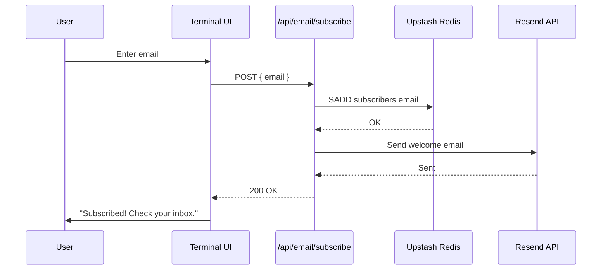

# Email System

Stocky Terminal distributes daily market briefs to 70+ email subscribers using the Resend API. The system supports personalized emails, subscriber management, and a 1-10 rating system.

> [!info] Resend
> Resend is a modern email API built for developers. It provides reliable delivery, good deliverability rates, and a generous free tier. Stocky uses it for transactional emails (daily briefs) and subscriber management.

## Subscriber Management

### Subscribe Flow



### Unsubscribe Flow

Every email includes an unsubscribe link:
```
POST /api/email/unsubscribe { email }
→ SREM subscribers email
→ Confirmation email sent
```

### Subscriber Storage

```typescript
// Redis Set
// Key: 'subscribers'
// Members: email addresses

// Subscribe
await redis.sadd('subscribers', email);

// Unsubscribe
await redis.srem('subscribers', email);

// Get all subscribers
const subscribers = await redis.smembers('subscribers');
// Returns: ['user1@gmail.com', 'user2@outlook.com', ...]
```

## Email Sending

### Rate Limiting

| Constraint | Value |
|---|---|
| Resend rate limit | 2 emails/second (current plan) |
| Delay between sends | 500ms |
| Total send time (70 subscribers) | ~35 seconds |
| Total send time (500 subscribers) | ~4.2 minutes |

```typescript
async function sendBriefToAll(brief: Brief): Promise<void> {
    const subscribers = await redis.smembers('subscribers');

    for (const email of subscribers) {
        try {
            await resend.emails.send({
                from: 'Stocky Terminal <brief@stockyai.xyz>',
                to: email,
                subject: brief.subject,
                html: personalize(brief.html, email),
            });
        } catch (error) {
            console.error(`Failed to send to ${email}: ${error.message}`);
            // Don't throw — continue sending to other subscribers
        }

        // Rate limit: 2/second
        await new Promise(r => setTimeout(r, 500));
    }
}
```

### Personalization

Each email is personalized:

```typescript
function personalize(html: string, email: string): string {
    // Add subscriber-specific elements
    const rateUrl = `https://terminal.stockyai.xyz/rate?email=${encodeURIComponent(email)}`;
    const unsubUrl = `https://terminal.stockyai.xyz/unsubscribe?email=${encodeURIComponent(email)}`;

    return html
        .replace('{{RATE_URL}}', rateUrl)
        .replace('{{UNSUB_URL}}', unsubUrl)
        .replace('{{EMAIL}}', email);
}
```

## Rating System

### 1-10 Scale

| Rating | Label | Emoji | Color |
|---|---|---|---|
| 1-2 | Poor | - | Red |
| 3-4 | Below Average | - | Orange |
| 5-6 | Average | - | Yellow |
| 7-8 | Good | - | Light Green |
| 9-10 | Excellent | - | Green |

### Redis Storage

```typescript
// Store rating
const key = `rating:${email}:${edition}`;
await redis.set(key, rating.toString(), { ex: 90 * 24 * 60 * 60 }); // 90-day TTL

// Average for an edition
const keys = await redis.keys(`rating:*:${edition}`);
const values = await Promise.all(keys.map(k => redis.get(k)));
const ratings = values.map(Number).filter(n => !isNaN(n));
const average = ratings.reduce((a, b) => a + b, 0) / ratings.length;
```

> [!tip] 90-Day TTL
> Ratings expire after 90 days. This keeps the Redis memory footprint bounded as the subscriber list and edition count grow. Historical average ratings are preserved in the brief's Redis sorted set entry.

## Email Design

The brief email uses inline CSS (email clients don't support `<style>` blocks reliably):

- Dark background matching the terminal aesthetic
- Green accent color for bullish data, red for bearish
- Tables for market data (all markets, sectors, commodities)
- AI-generated analysis section
- Rating widget (1-10 clickable numbers)
- Social sharing buttons (WhatsApp, Telegram, LinkedIn, X)
- Unsubscribe link in footer

> [!warning] Email Client Compatibility
> Email HTML is much more constrained than web HTML. No CSS Grid, no Flexbox (reliable), no JavaScript, limited `<style>` support. All styling must be inline. The brief template is tested against Gmail, Outlook, and Apple Mail.

## Metrics

| Metric | Tracked | Storage |
|---|---|---|
| Total subscribers | Yes | Redis set size |
| Open rate | No (requires tracking pixel) | — |
| Rating average | Yes | Redis |
| Rating count | Yes | Redis key count |
| Unsubscribe count | No (could track) | — |

## Related Notes

- [[Daily Market Brief]]
- [[Database & Caching]]
- [[Distribution Channels]]
- [[Deployment]]
