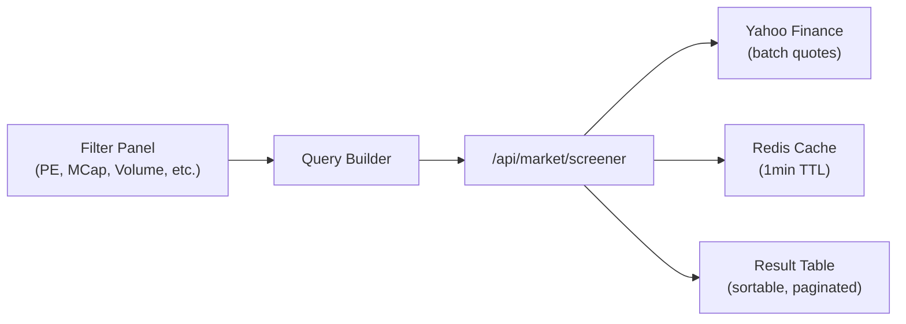
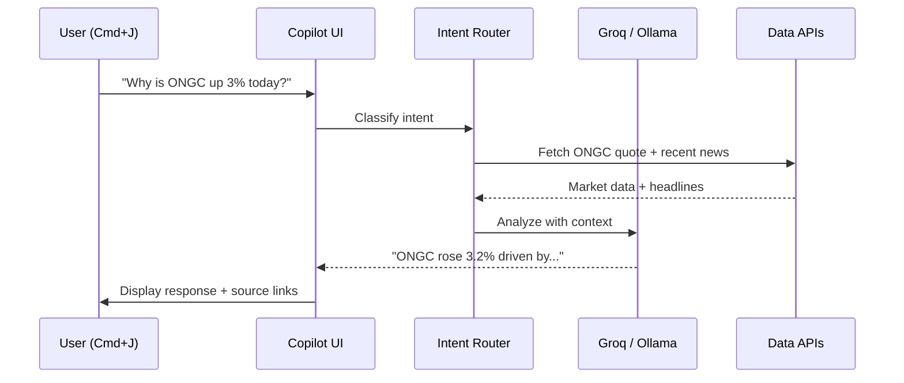
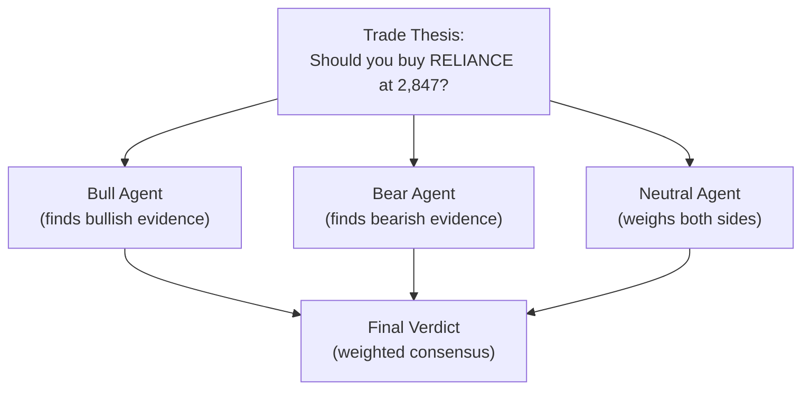
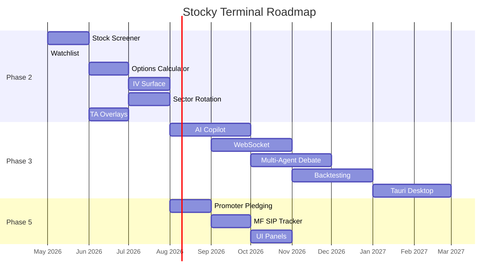

# Future Roadmap

Three phases of development remain for Stocky Terminal: Phase 2 (Enhanced Trading Tools), Phase 3 (AI Copilot & Real-Time), and Phase 5 (India-Specific Deep Data).

> [!info] Prioritization
> Features are prioritized by: (1) user demand from WhatsApp community and email feedback, (2) competitive differentiation, (3) technical feasibility with current architecture.

## Phase 2 — Enhanced Trading Tools

| Feature | Priority | Complexity | Description |
|---|---|---|---|
| **Stock Screener** | High | Medium | Filter NSE stocks by technical + fundamental criteria (PE, market cap, 52W range, volume, RSI, MACD) |
| **Watchlist** | High | Low | Persistent watchlist with alerts, stored in localStorage + optional email alerts |
| **Options Calculator** | High | Medium | Black-Scholes calculator with P&L visualization for multi-leg strategies |
| **IV Surface** | Medium | High | 3D implied volatility surface across strikes and expiries using deck.gl |
| **Sector Rotation** | Medium | Medium | Sector momentum heatmap showing money flow between sectors over 1W/1M/3M |
| **TA Overlays** | Medium | Medium | Moving averages (SMA, EMA), RSI, MACD, Bollinger Bands on TradingView charts |

### Screener Design

### Options Calculator

The calculator will support:
- Single leg: call/put buy/sell
- Multi-leg: spreads (bull/bear call/put), straddles, strangles, iron condors, butterflies
- P&L chart showing profit/loss at expiry across price range
- Greeks display for the combined position
- Break-even points marked on chart

> [!tip] IV Surface with deck.gl
> Since Stocky already uses deck.gl for the OSINT map, the same WebGL infrastructure can render a 3D IV surface. This would be visually striking and technically unique among free terminals.

## Phase 3 — AI Copilot & Real-Time

| Feature | Priority | Complexity | Description |
|---|---|---|---|
| **AI Copilot (Cmd+J)** | High | High | In-terminal AI assistant. Ask "What's driving Nifty today?" or "Analyze RELIANCE options flow" |
| **Multi-Agent Debate** | Medium | High | Bull, bear, and neutral AI agents debate a trade thesis (inspired by TradingAgents) |
| **WebSocket Live Data** | High | High | Replace polling with WebSocket for real-time tick data |
| **Backtesting Engine** | Medium | High | Backtest strategies against historical OHLC data with P&L curves |
| **Tauri Desktop App** | Low | Medium | Package as native desktop app using Tauri (Rust + WebView) |

### AI Copilot Architecture

### Multi-Agent Debate

Inspired by the TradingAgents project (48K GitHub stars):

### WebSocket Migration

| Current (Polling) | Future (WebSocket) |
|---|---|
| 15s refresh interval | Real-time tick updates |
| ~4 API calls/minute per symbol | 1 persistent connection |
| 100ms+ latency | <10ms latency |
| Works on Vercel Edge | Requires WebSocket server (Fly.io, Railway) |

> [!warning] WebSocket Infrastructure
> Vercel Edge Functions don't support persistent WebSocket connections. Phase 3 will require an additional server (Fly.io or Railway) for WebSocket. This is the most significant infrastructure change in the roadmap.

## Phase 5 — India-Specific Deep Data

| Feature | Priority | Complexity | Description |
|---|---|---|---|
| **Promoter Pledging Tracker** | High | Medium | Track promoter shareholding and pledge % for NSE stocks — major risk indicator |
| **Mutual Fund SIP Tracker** | Medium | Medium | Track SIP flows (AMFI data), AUM trends, top MF schemes |
| **Enhanced UI Panels** | Medium | Low | Customizable panel grid, drag-and-drop layout, panel presets |
| **Earnings Calendar** | High | Low | Upcoming quarterly results with estimates vs. actuals |
| **Insider Trading** | Medium | Medium | SAST data from SEBI — promoter buys/sells |

### Promoter Pledging

| Risk Level | Pledge % | Color | Action |
|---|---|---|---|
| Safe | <10% | Green | No concern |
| Caution | 10-30% | Yellow | Monitor |
| High Risk | 30-50% | Orange | Elevated risk |
| Danger | >50% | Red | Significant risk of forced selling |

> [!tip] Why Promoter Pledging?
> When promoters pledge shares as collateral for loans and stock prices fall, lenders can force-sell pledged shares — creating a cascading crash. Several major Indian stocks (Zee, Adani Group) have experienced pledge-driven crashes. Tracking this data is essential for risk management.

## Timeline (Estimated)

> [!warning] Timeline Caveat
> This is a solo developer project. Timelines are aspirational and depend on community contributions and available development time. Phase 2 features are most likely to ship on schedule as they build on existing architecture.

## Related Notes

- [[Completed Features]]
- [[Project Overview]]
- [[Architecture Decisions]]
- [[Tech Stack]]
- [[Competitive Landscape]]
