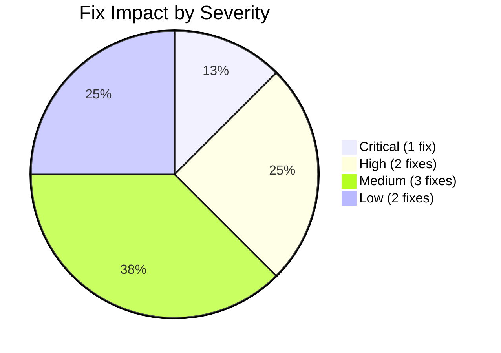

# Code Audit Fixes

A comprehensive code audit identified 8 ranked issues in Stocky Terminal. This note documents each issue, its severity, the fix applied, and the current status.

> [!info] Audit Methodology
> The audit reviewed all API endpoints, cron jobs, frontend panels, and data pipelines. Issues were ranked by user impact (does it show wrong data?), frequency (how often does it trigger?), and fix complexity.

## Issue Ranking

| Rank | Issue | Severity | Impact | Status |
|---|---|---|---|---|
| 1 | Gift Nifty stale data | Critical | Wrong pre-market data | Fixed |
| 2 | Nifty expected range miscalculation | High | Incorrect range display | Fixed |
| 3 | OHLC labels showing wrong values | High | Incorrect chart data labels | Fixed |
| 4 | Edition numbering race condition | Medium | Duplicate brief editions | Fixed |
| 5 | Signal flip oscillation | Medium | Signals flipping repeatedly | Fixed |
| 6 | ONGC AI misframe | Medium | Wrong signal direction | Fixed |
| 7 | Confidence disclaimer missing | Low | User might overtrust signals | Fixed |
| 8 | Map lazy-load timing | Low | Brief visual glitch | Fixed |

## Issue 1: Gift Nifty Stale Data (Critical)

**Problem:** Gift Nifty displayed previous session's closing value instead of live pre-market data during early morning hours.

**Root Cause:** The NSE India session cookie expired between the cron job's cookie fetch and the actual data request. Edge function cold starts added enough delay for the cookie to become invalid.

**Fix:**
- Added retry logic with fresh cookie on 403 response
- Reduced time between cookie fetch and data request
- Added `isStale` flag when Gift Nifty data is older than 30 minutes

```typescript
async function fetchGiftNiftyWithRetry(): Promise<GiftNiftyData> {
    for (let attempt = 0; attempt < 3; attempt++) {
        const cookies = await getSessionCookies();
        const response = await fetchWithCookies(cookies);
        if (response.ok) return response.json();
        if (response.status === 403) continue; // Retry with new cookies
        throw new Error(`Gift Nifty fetch failed: ${response.status}`);
    }
    throw new Error('Gift Nifty: max retries exceeded');
}
```

> [!warning] Most User-Impacting Bug
> Gift Nifty is the first data point morning traders check. Stale data here could mislead pre-market positioning decisions.

## Issue 2: Nifty Expected Range

**Problem:** The "expected range" for Nifty (displayed in the brief) used a naive ±1% calculation instead of accounting for implied volatility.

**Root Cause:** Original implementation:
```typescript
// BUG: Hardcoded 1% range
const expectedHigh = niftyClose * 1.01;
const expectedLow = niftyClose * 0.99;
```

**Fix:** Use ATM implied volatility from options chain to calculate expected daily range:
```typescript
const dailyIV = atmIV / Math.sqrt(252); // Annualized IV → daily
const expectedHigh = niftyClose * (1 + dailyIV);
const expectedLow = niftyClose * (1 - dailyIV);
```

## Issue 3: OHLC Labels

**Problem:** Chart tooltip displayed Open in the High position and vice versa.

**Root Cause:** Destructuring order was wrong:
```typescript
// BUG
const { open, close, high, low } = candle;
tooltip.innerHTML = `O: ${high} H: ${open} L: ${low} C: ${close}`;

// FIX
tooltip.innerHTML = `O: ${open} H: ${high} L: ${low} C: ${close}`;
```

**Fix:** Corrected the template literal order and added a unit test for tooltip rendering.

## Issue 4: Edition Numbering

See [[Technical Learnings]] — Edition Numbering Race Condition.

**Fix:** `redis.get()` + increment → `redis.incr()` (atomic operation).

## Issue 5: Signal Flip Oscillation

See [[Technical Learnings]] — Signal Flip Fix.

**Fix:** Added `previouslyFlipped` flag; signals can only be flipped once.

## Issue 6: ONGC AI Misframe

See [[Technical Learnings]] — ONGC Ticker Context Fix.

**Fix:** Created [[Ticker Context System]] with explicit sector dynamics for 15 assets.

## Issue 7: Confidence Disclaimer

**Problem:** AI-generated trade signals displayed confidence percentages (e.g., "85% confidence") without any disclaimer that these are AI-generated estimates, not financial advice.

**Root Cause:** Missing UI element — the signals panel had no disclaimer text.

**Fix:** Added a persistent disclaimer at the bottom of the signals panel:

```html
<div class="signal-disclaimer">
    AI-generated signals are for informational purposes only.
    Not financial advice. Confidence levels are model estimates
    and do not represent probability of profit. Always do your
    own research before trading.
</div>
```

> [!tip] Legal Protection
> This disclaimer is essential for any financial tool displaying trading signals. While Stocky is free and open-source, displaying AI "confidence" without context could mislead users into thinking it represents a probability of profit.

## Issue 8: Map Lazy-Load Timing

**Problem:** When opening the OSINT map panel, there was a brief flash of unstyled map (gray background, no tiles) before the map fully initialized.

**Root Cause:** The map container was made visible (`display: block`) before deck.gl + MapLibre finished initializing and loading the first tiles.

**Fix:** Keep the map container hidden and show a loading skeleton until the map fires its `load` event:

```typescript
async function initMap(): Promise<void> {
    const container = document.getElementById('map-container')!;
    container.classList.add('loading'); // Shows skeleton

    const map = new maplibregl.Map({ container, ... });

    await new Promise<void>((resolve) => {
        map.on('load', () => {
            container.classList.remove('loading');
            resolve();
        });
    });

    // Initialize deck.gl overlay after map is loaded
    const deckOverlay = new DeckOverlay({ layers: [...] });
    map.addControl(deckOverlay);
}
```

## Fix Impact Summary



| Severity | Fixes | User Impact |
|---|---|---|
| Critical | 1 | Wrong data shown to users |
| High | 2 | Incorrect calculations displayed |
| Medium | 3 | System behavior issues (no wrong data shown) |
| Low | 2 | Visual/UX polish issues |

> [!warning] Remaining Technical Debt
> While all 8 audit issues are fixed, additional areas of technical debt remain:
> - No unit tests (manual testing only)
> - No error tracking (Sentry or similar)
> - No performance monitoring (Web Vitals)
> - No integration tests for cron jobs
> These are tracked in the [[Future Roadmap]] as infrastructure improvements.

## Related Notes

- [[Technical Learnings]]
- [[Architecture Decisions]]
- [[Signal Validation]]
- [[Ticker Context System]]
- [[Map System]]
- [[Daily Market Brief]]
